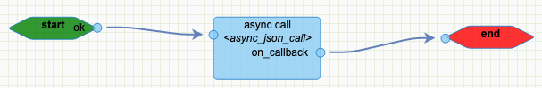
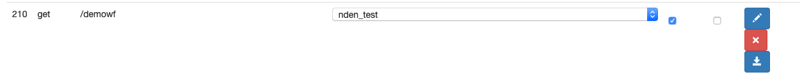
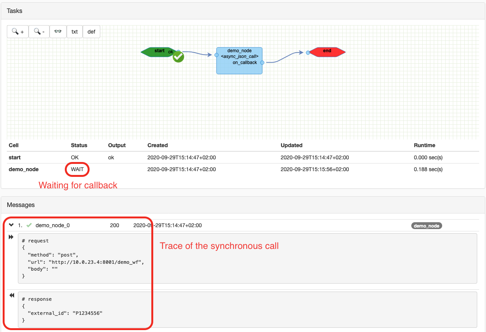
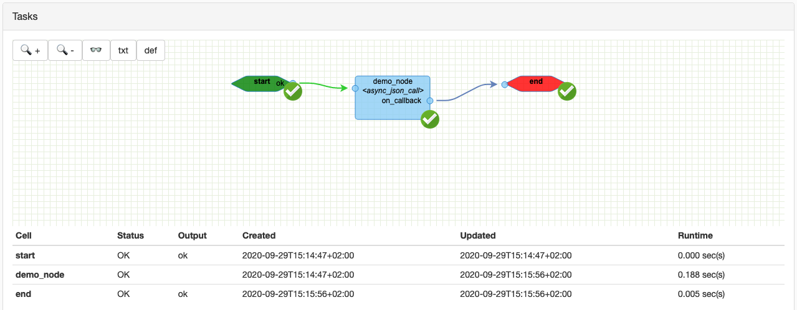
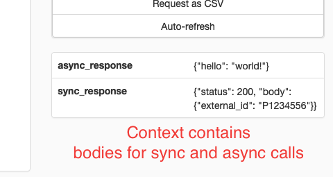

# Asynchronous call

Some workflows need to orchestrate calls with other parties working asynchronously.  

## Json call with given unique ID

Here is a sample workflow (named nden_test):



See the settings of the async_json_call for filling it up: [async_json_call](./cells/http_json_call.html#[boolean_expression](./cells/generics.html#boolean_expression)) 

### Mock service for local testing

```python
# demo_srv.py
from flask import Flask, jsonify
app = Flask(__name__)

@app.route('/demo_wf', methods=['POST'])
def demo_wf():
    return jsonify({"external_id": "P1234556"})
```

Run with `FLASK_APP=demo_srv.py flask run -p 8001 --host 0.0.0.0`

### Expose the workflow



### Instantiate the workflow

```shell script
curl -H"Authorization: Bearer <user token>" https://<host>/api/v01/custom/demowf
{"id": 166733}
```

So the new instance id is `166733`.  
Then check the instance at `https://<host>/transactions/<instance id>`, the call is waiting.  



#### Trigger callback

```shell script
curl -X POST -d'{"hello": "world!"}' -H"Content-Type: application/json" -H"Authorization: Bearer <user token>" http://<host>/api/v01/transactions/callbacks/<external id: P1234556>
```

#### Check the workflow completion



Also, take a look at the values stored in the context of the instance to know what will be available in the rest of the workflow.  

