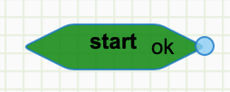
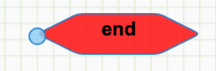
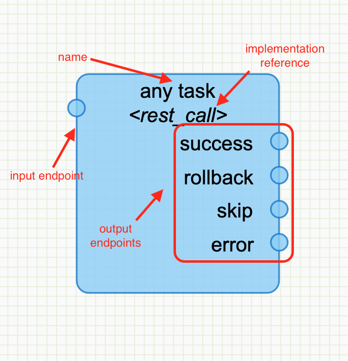
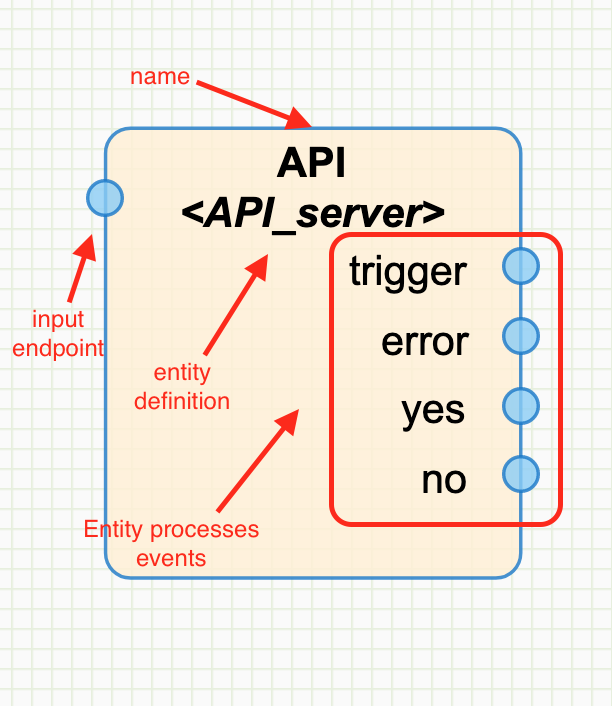

# Basics

## Cell or task visualization

There are 4 kinds of different elements in a workflow diagram

### start
Represent the start point of the workflow.  
That's why there is no input.



### end
Represent the end point of the workflow.  
That's why there is no output.



### normal task
Represent an atomic piece of processing.  
It should be implemented to succeed or fail, but it shouldn't *partially* succeed.  
So the output shuold mark a clear situation about the processing.



### entities
Represent a set of processes running outside the workflow engine.  
Usually in another entity / system etc...



## Evaluation context

Every string evaluation methods (described hereunder) are interpreted with a set of variables available.

| variable                  | type                                             | description                                                                                                                        |
|---------------------------|--------------------------------------------------|------------------------------------------------------------------------------------------------------------------------------------|
| context                   | dict<key: value as string>                       |                                                                                                                                    |
| tasks                     | dict<task name: status>                          |                                                                                                                                    |
| request                   | dict or string                                   | original event content loaded as JSON if possible \(with properties "body", "url" and "method"\); or as a string if not JSON       |
| settings                  | dict<key: value>                                 | copy of the configuration available \(careful, it may contain senstive data\)                                                      |
| sub\_instances\_responses | list<dict<instance\_id: instance\_id, value: v>> | is the list of sub instances results \(if any\)\.  the value is the content of the key "\*cb\_response\*" within the sub\_workflow |

Note about `request`:  
When instantiated by a custom route, the JSON body contains always:

| request attribute    | description                                                  |
|----------------------|--------------------------------------------------------------|
| method               | the HTTP method                                              |
| url                  | The url triggered                                            |
| params               | parameters from the query string as a dict                   |
| match_info           | a dict of URL parameters if any (e.g /t/{tenant_id}/tasks)   |
| body                 | body as string or dict                                       |

## Templates

Many cells accepts inputs as jinja2 template to go beyond simple strings and access some other parts of the platform.  

### Filters

The regular built-in filters available in the Jinja framework are extended with:  
(ref: https://jinja.palletsprojects.com/en/2.11.x/templates/#list-of-builtin-filters)

#### pp_dict  
Read as "pretty print dict", it turns a dict into a string (with 4 spaces indentation)
  
e.g `{{ request.body.user | pp_dict }}`
 
#### dict_filter  
Prepare a dict with only keys present in the list.

e.g `{{ request.body | dict_filter("username", "email") }}`

#### json_query  
Query a json using "jmespath" query language (see http://jmespath.org)

e.g `{{ instance | json_query('tagged_instances[*].block_device_mapping.*.volume_id') }}`

#### url_qs
Return a dict of query params from a URL string (return an empty string if no params)  

e.g `{{ request.url | url_qs | pp_dict }}`

#### url_raw_query  
Return the params part of the URL given as a string  

#### json  
Turn a JSON string into a dict (note: serialized python dicts are usually not valid JSON objects)

#### url_path  
Return the path path of the URL given as a string

#### combine  
Combine several dicts together.
Pretty useful to patch and/or enrich a dict with default value(s).

e.g `{{ request.body | combine({"attribute": "default value"}) }}`

In this example, the output is a dictionary as "request.body" 
with the property "attribute" set to "default value" if not present in the request body.

#### rest2dict  
Because instance's context is a map into the database "string" to "string",
it might be easier to use this filter to ensure the "body" property is turned into a dict.

## Python code

Some cells accept inputs to be evaluated as python code.  
(usually because the expressiveness of Jinja is not sufficient)    
Some words are black listed in the expression given here (for security obvious reason)

```python
"import",
"eval",
"exec",
"async",
"with ",
"open",
"for",
"while",
"raise",
"breakpoint",
"print",
"input",
"__",
"map",
"filter",
"reduce",
"def ",
"lambda",
```
