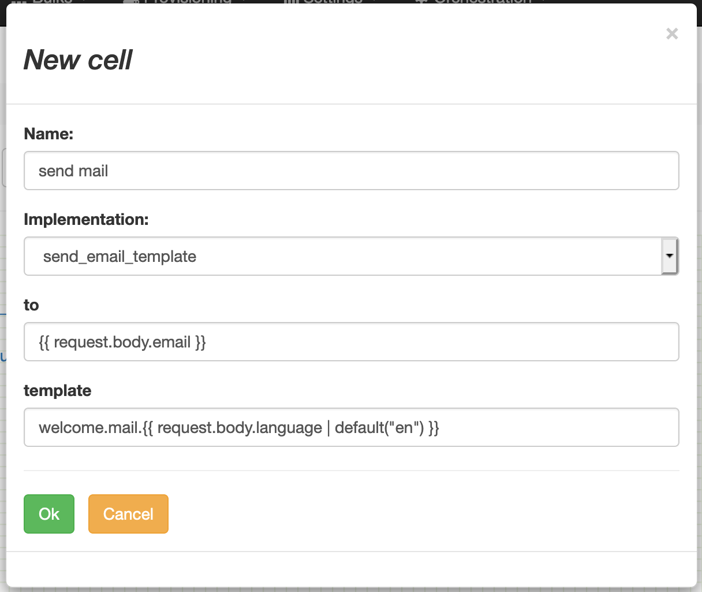

# Email

## send_raw_email
tbc...

## send_email_template
Send an email with a body based on a template defined in "templates" page.
Those templates are regular Jinja2 templates evaluated using the context as usual.

Variables "to" and "template" are templates which can be also evaluated.

- `to` has to be resolved into a single address, or a list of addresses separated with ",".
- `template` has to be resolved into a reference defined in the template repository.
