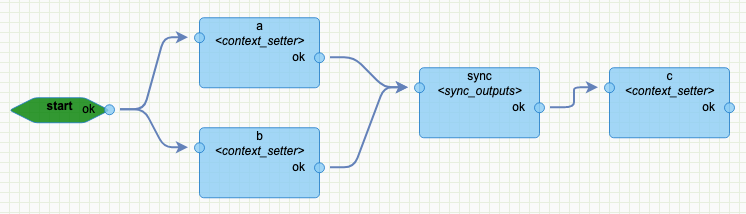
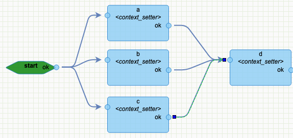
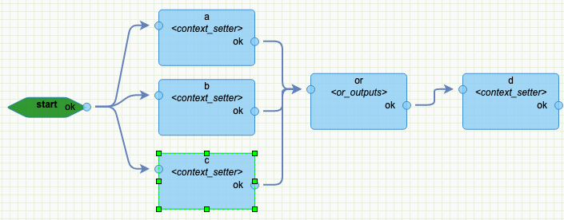
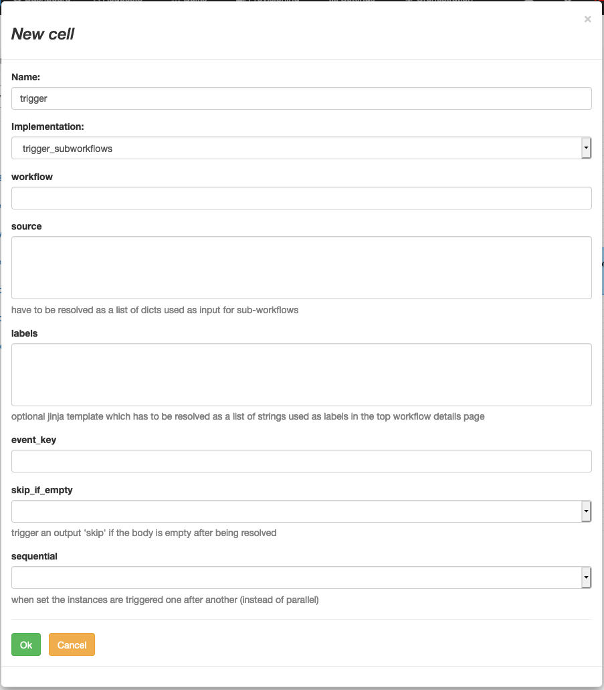
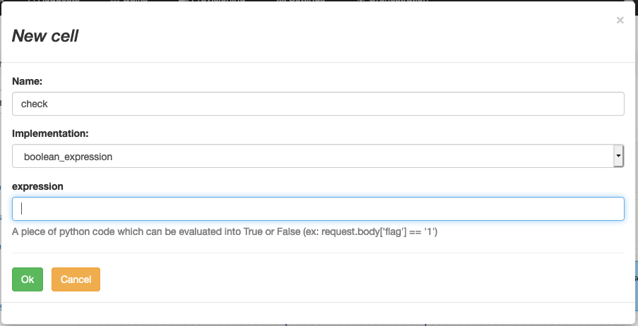

# Generics

## start

The "start" task is the start point of any workflow.

It has no parameters, no processing and shouldn't fail on any correctly configured platform.

## end

The "end" task mark the end of the workflow.

It carries some processing to close properly the workflow:
* Mark the instance status as SUCCESS if there is no *pending* errors (read: task(s) in status ERROR); set to ERROR otherwise.
* Close all pending timers.
* [if it's a sub workflow] trigger the parent workflow
* handle configured callbacks (if any)

## sync_outputs

Used to synchronize multiple outputs before moving forward with the rest of the workflow.

Sample:  

Explanation: This configuration makes the task "c" waiting for "a" and "b" to be completed before starting.

## or_outputs

When several tasks goes in parallel and need to merge into 1 flow at some point.

To illustrate this, let's imagine the following:

_"start" triggers "a", "b" and "c"
(so "a", "b" and "c" run in parallel)
Then we want "d" to be triggered *once* after any of "a", "b" *or* "c" being completed._

Problem with "obvious" solution:  

Why? in that scenario, "a", "b" and "c" will run "d" and further tasks 3 times.

Good solution:  

## trigger_subworkflows

Sometimes it's convenient to factor out some processing into a separate workflow,
and loop over inputs for these workflow (1 instance per input) as sub-instances. 

| variable        | type                       | description                                                                                                                                                                                    |
|-----------------|----------------------------|------------------------------------------------------------------------------------------------------------------------------------------------------------------------------------------------|
| workflow        | string                     | the name of the workflow to be triggered                                                                                                                                                       |
| source          | jinja2 template            | has to be evaluated into a list of dict's used as input for sub\-workflows                                                                                                                     |
| labels          | jinja2 template            | in the details page of the top instance, the sub instances appear as numeric index\.\.\. it may be improved by giving labels \(need to be resolved into the same length list than the source\) |
| event\_key      | string                     | set the event\_key field of the initial event of the sub\-workflow                                                                                                                             |
| skip\_if\_empty | boolean \(default: False\) | eventually if the output of "source" evaluation returns an empty list; the output become "skip"\. \(raise an error otherwise\)                                                                 |
| sequential      | boolean \(default: False\) | Instead of parallel run, it waits for the a sub\_workflow to end before launching the next one                                                                                                 |

Samples:

tbc...

## boolean_expression

This task evaluate an expression as boolean.  
The expression is a piece of python code.  

Samples:
- request["body"]["profile"] == "admin"
- settings.get("auto_validate", "false") == "true"
