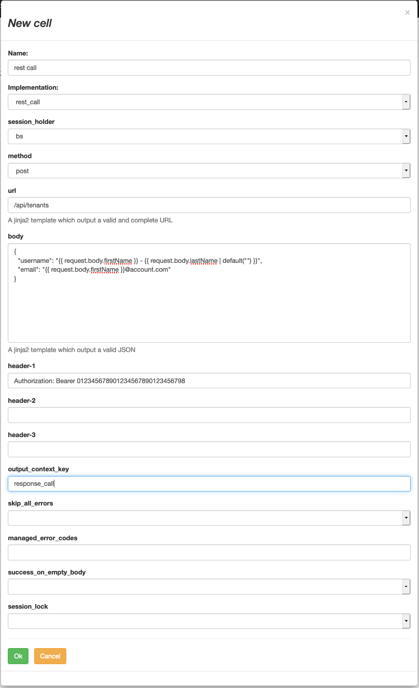

# HTTP / JSON call

## rest_call
This the default implementation to make HTTP / REST calls to other parties.

| variable              | type            | description                                                                                                                                                                                                                                                                                                                                                            |
|-----------------------|-----------------|------------------------------------------------------------------------------------------------------------------------------------------------------------------------------------------------------------------------------------------------------------------------------------------------------------------------------------------------------------------------|
| session_holder        | N/A             |  A session holder is a reference to a client session living for a long time outside the task or the workflow itself.  This is a way to optimize calls to a external entity often targeted or using sessions based authentication (e.g cookies). If you don't know what this is about, just leave it empty (a new default session will be created for the current task) |
| method                | string          | the HTTP method to be used                                                                                                                                                                                                                                                                                                                                             |
| url                   | jinja2 template | A template to be resolved into a full fledged URL _or_ a URL relative to the session holder base URL.                                                                                                                                                                                                                                                                  |
| body                  | jinja2 template | A template to be resolved into a JSON body to be sent.                                                                                                                                                                                                                                                                                                                 |
| header-{1,2,3}        | string*         | A set of custom HTTP headers to be provided. (the form is <header name>: <value>)                                                                                                                                                                                                                                                                                      |
| output_context_key    | string          | The key to be used to store the response                                                                                                                                                                                                                                                                                                                               |
| skip_all_errors       | boolean         | if true, all HTTP errors are ignored and the flow move forward anyway                                                                                                                                                                                                                                                                                                  |
| managed_error_codes   | string          | either a list of HTTP error codes automatically turned into output "error" or the magic value "*" to swallow all error codes.                                                                                                                                                                                                                                          |
| success_on_empty_body | boolean         | skip the call and return a "success" if the resolution of the body gives an empty JSON body                                                                                                                                                                                                                                                                            |
| session_lock          | string          | link the call to a Semaphore throttling the throughput of the whole platform against some entities.                                                                                                                                                                                                                                                                    |

Note about header: There is a magical token {user_token} which will be replaced by the user token initiating the workflow.
Careful, the token is a very sensitive information and shouldn't be shared with untrusted platforms.

## proxy_call
(only available in a proxy environment)

This will forward the original call (trigger of the workflow) to some other session holder.

typical use case: when an endpoint is overwritten,
it might be easy to forward the original call and then do some additional processing.

## proxy_session_call
(only available in a proxy environment)

This will make an HTTP / REST call using the session of the user who triggered the workflow.

typical use case: a user is logged against a proxied backend (e.g Broadworks)
and the workflow want to make some call(s) on behalf of the user (inheriting its session - including user level, capabilities, etc...)
