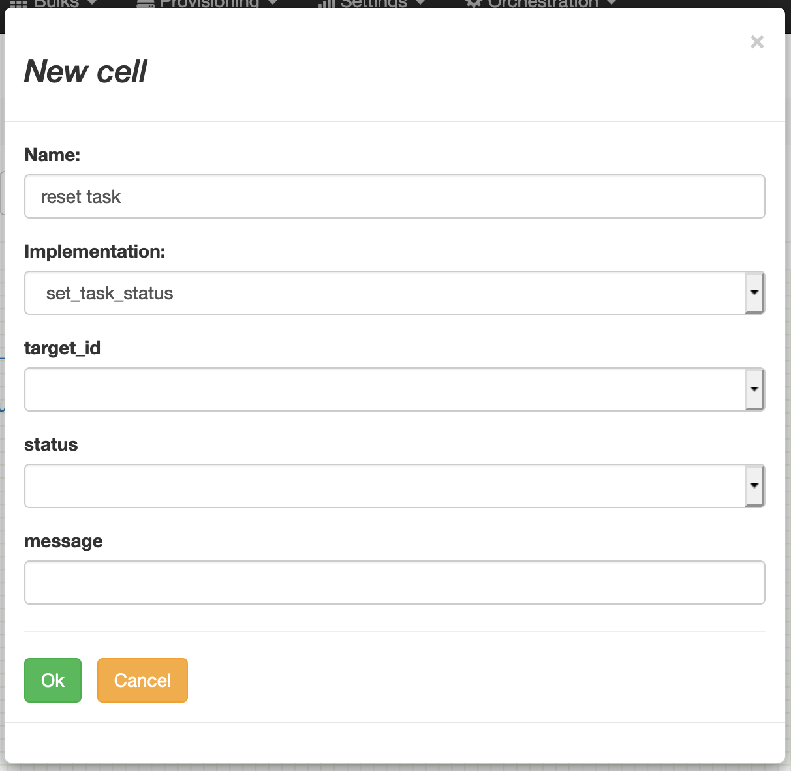

# Task manipulation

## set_task_status
This task force the status of another task in workflow.

Sample use case: some post processing event may lead to put
the original trigger in error to ease replay of the whole process.

Note: the target task has to be defined already before creating this one.

| variable        | type              | description                                                                                                                                                                                    |
|-----------------|-------------------|------------------------------------------------------------------------------------------------------------------------------------------------------------------------------------------------|
| target_id       | string            | the name of the task to be updated in the current workflow |
| status          | string            | the target status |
| message         | string            | the message to comment the status change |
