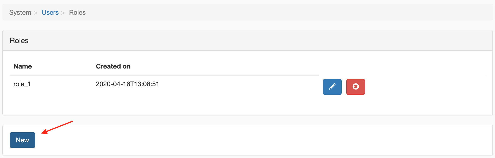
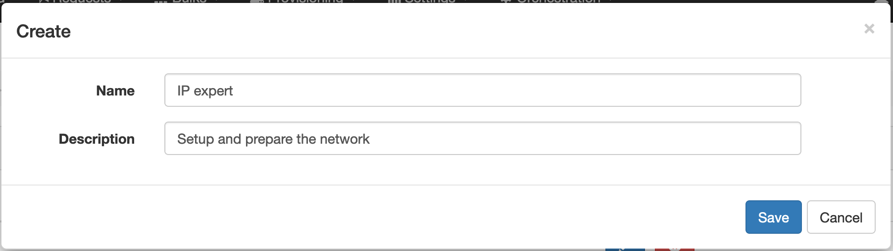
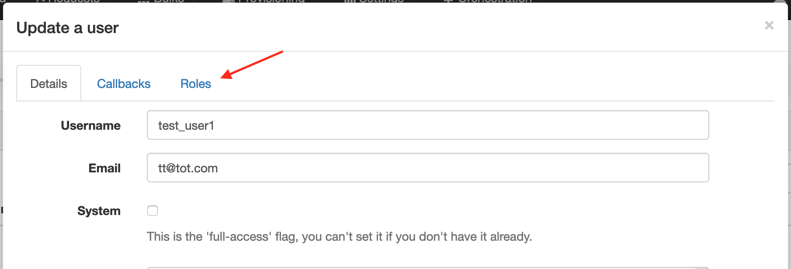
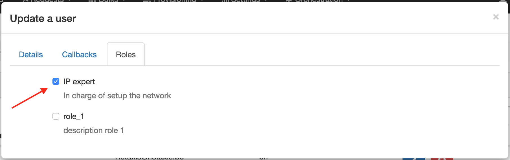
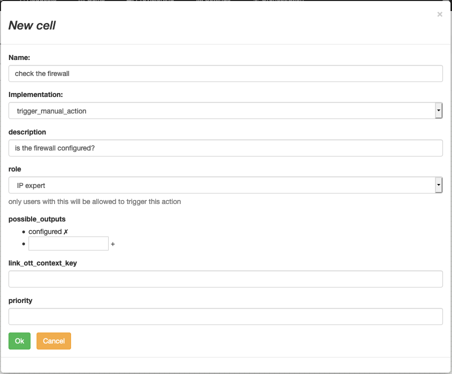
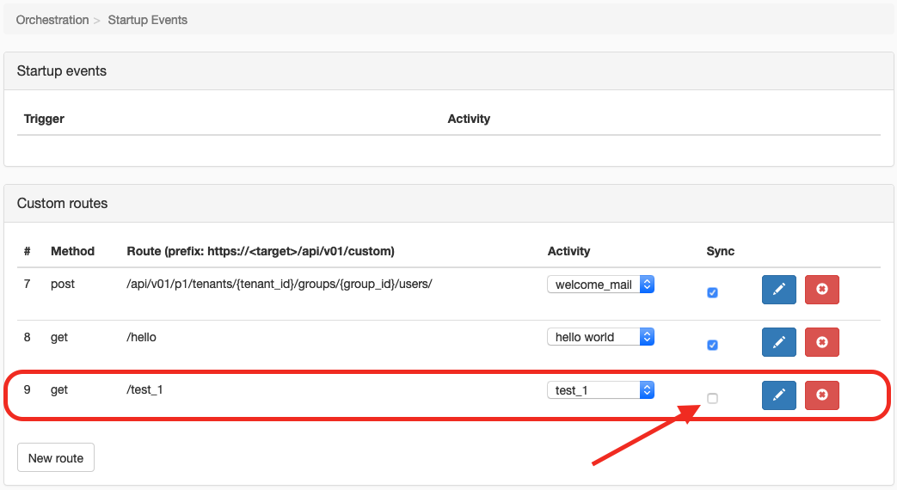
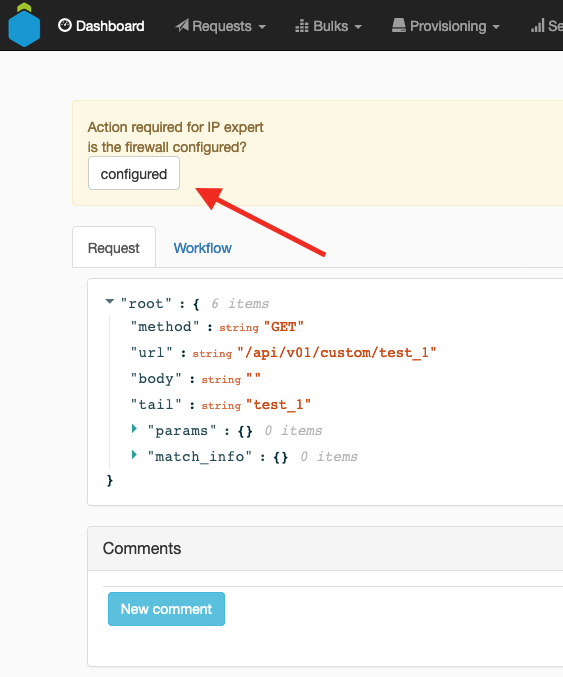
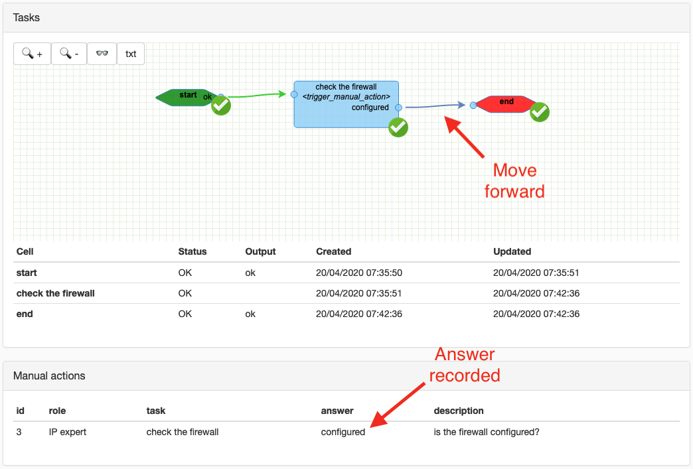
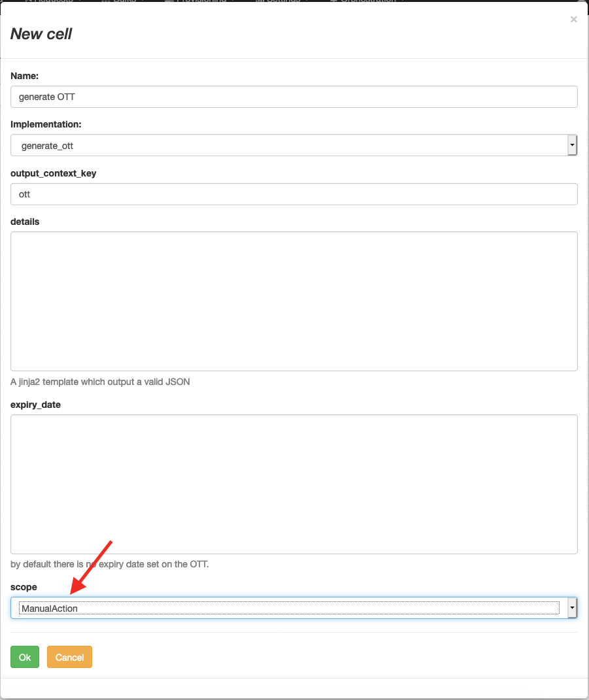

# External actions

Some workflows involve manual actions.

## An action for known / logged users

Use case: Wait for a trigger from a external action, to be realized by a known / logged in user.

### Define a role for users

In the page `System > Users > Roles`:




### Assign the role to someone

In the user details, go to the 'Roles' tab.




### Add a manual action your workflow



### Trigger your workflow

Because the workflow contains a manual action, it doesn't make sense to link it to a synchronous route.



```shell script
curl -H "Authorization: Bearer <user token>" \
    http://<host>/api/v01/custom/test_1
```

And the platform returns the instance id of the workflow created:
```json
{"id": 77}
```

### Trigger the action

The action will be visible in the details of the workflow instance _but_ only a user with the correct role assigned will be able to trigger it.

In the instance details page (e.g `http://<host>/transactions/77`)



When triggered, the answer is recorded and the workflow move forward.



## Actions from unauthenticated users

Use case: Put the trigger directly in a mail (as a link for instance).

### Generate an OTT

To securely produce a link to let unauthenticated users to trigger an action, an OTT is needed.



### Add a manual action in your workflow


### Share the OTT with the right person(s)

The action to be prepared in the workflow instance will be available with the following HTTP link:
```http request
GET http://<host>/api/v01/transactions/manual_actions?output=<answer>&ott=<ott>
```

This way, this link can be used in an html button href for instance.

This link can be send by mail, shown on a page or shared via any mean.  
When the user will click the link, he will trigger the action directly (no login required).

### Trigger your workflow

Because the workflow contains a manual action, it doesn't make sense to link it to a synchronous route.

```shell script
curl -H "Authorization: Bearer <user token>" \
    http://<host>/api/v01/custom/test_1
```

And the platform returns the instance id of the workflow created:
```json
{"id": 78}
```

### Trigger the action

The action may be triggered with an HTTP call:

```shell script
curl http://<host>/api/v01/transactions/manual_actions?output=<answer>&ott=<ott>
```
