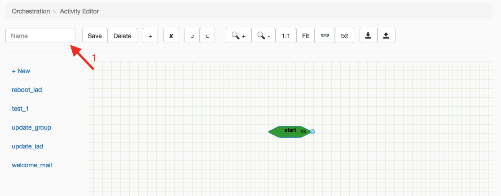
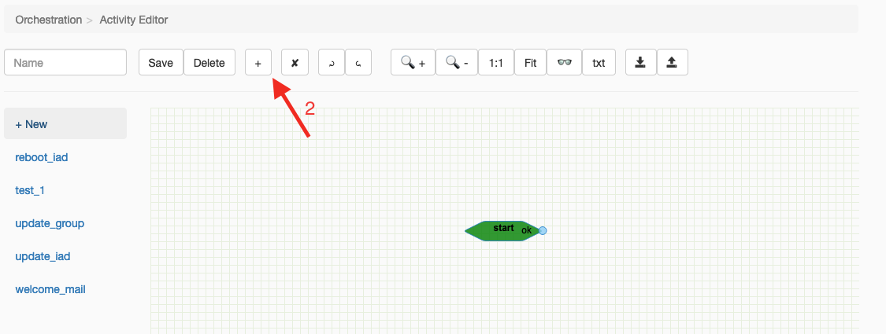
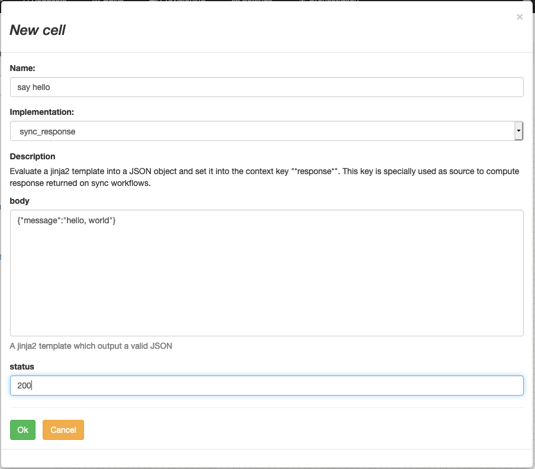
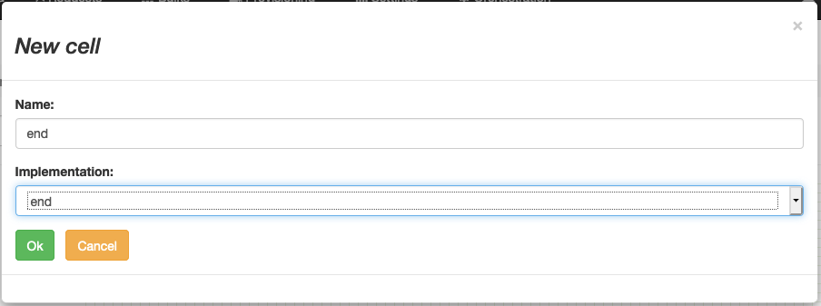
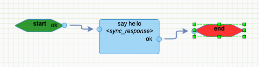
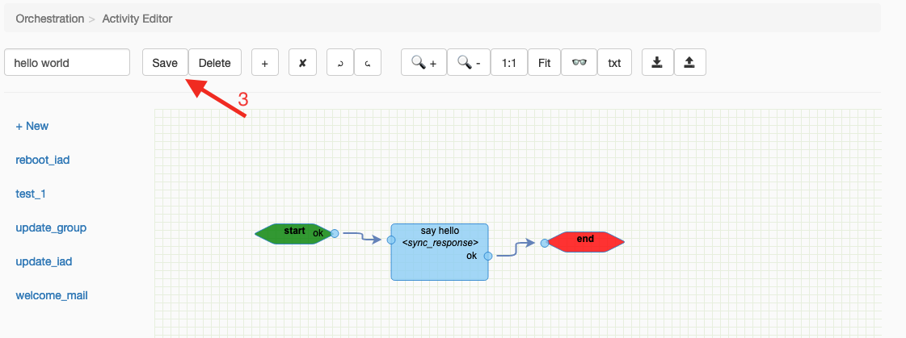
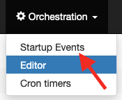
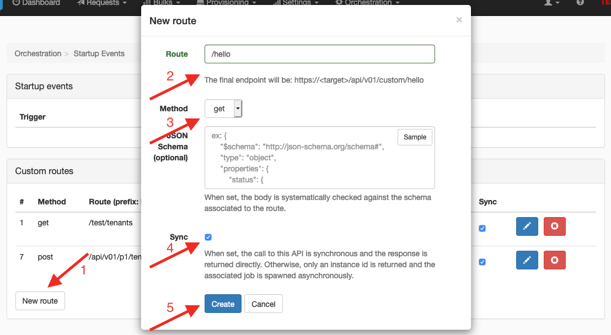
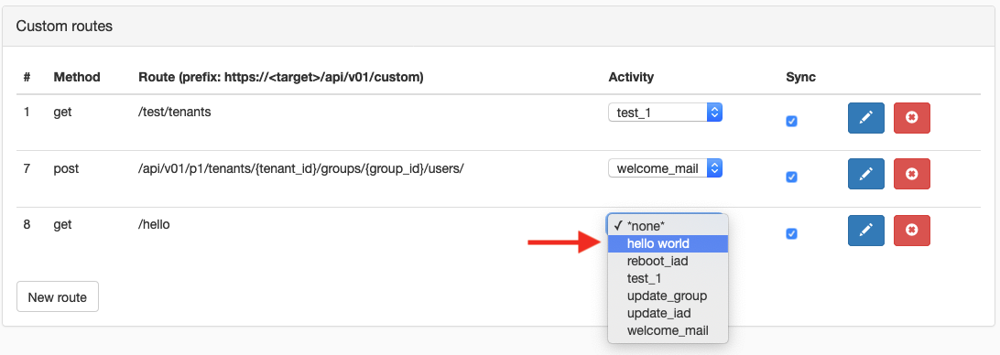
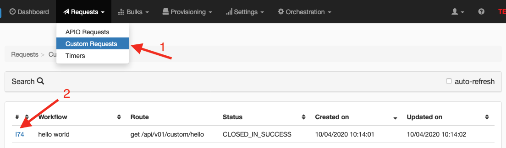

# Quick start

## Build your first workflow

### Let's give it a name



Every workflow need a name to be used as a reference in further operations.

### Be polite and say hello

To make our workflow polite, let's make it return "Hello, world" in it's body response.

First, we add a task to set the response


And we prepare it to return our message which need to be a valid JSON body.


### End the workflow

Let's add another cell to mark the end of the workflow


### Organise the cells

Now that you created all the tasks, you can drag them wherever you want to be visually convenient for you and your users.

Then you can link them together to organise their transitions from "start" to "end".
(use your mouse drag & drop any output* to any input**)

*: outputs are bullet on the right of the tasks  
**: inputs are bullets on the left of the tasks



### Save your hard work



So far, you have a workflow but it's not exposed, nor available to anyone to run it.

## Create an HTTP endpoint

To configure the HTTP endpoints, go to the "Startup events" page



Then create a new custom route (1).
This route need a path (2), and an HTTP method (3) - note the final path to help you share your future endpoint.

Because our workflow is expected to return its response in synchronous way, check the tick box to make your endpoint synchronous (4)

Don't forget to save your configuration (5).



## Bind your workflow

You can associate your brand new workflow to the new route you just created.



You are all set!

All users authenticated on the platform may trigger your workflow

## Trigger your workflow

The new endpoint may be triggered from any HTTP client.
For the sake of the sample, here is a call from cURL:
```shell script
curl -H "Authorization: Bearer <user token>" \
    http://<host>/api/v01/custom/hello
```

And the platform returns:
```json
{"message": "hello, world"}
```

## Follow your trace

You may retrieve your call in the "custom requests" menu (1).
And you can retrieve the details of the call and its execution going to the details page (2).


