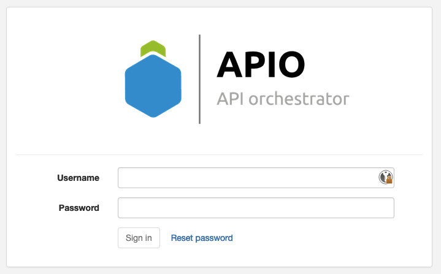
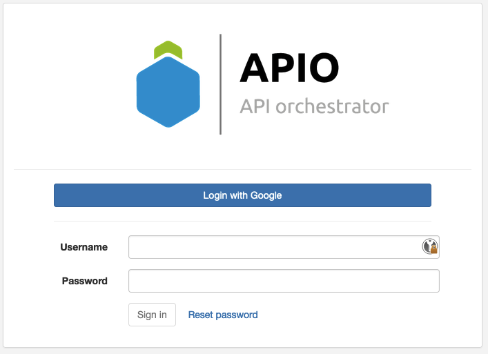
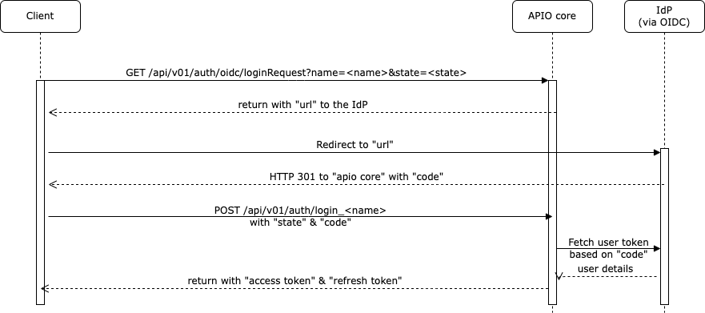
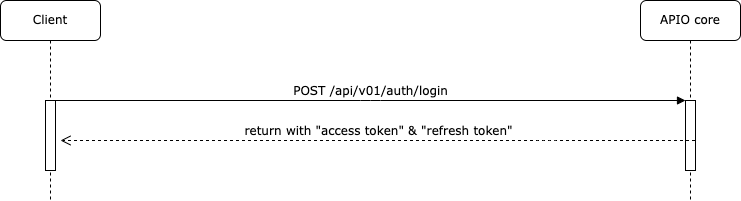

# Authentication

APIO core supports multiple authentication mechanisms. You can use them to authenticate your users and to authenticate your API calls.

At the end of each authentication process, the user gets a JWT token. The JWT token is used to authenticate the API calls by adding it to the `Authorization` header (Bearer [authentication scheme](https://developer.mozilla.org/en-US/docs/Web/HTTP/Authentication)) of the HTTP requests.

:::info

Refer to the [configuration documentation](configuration/sso) to configure the authentication mechanisms.

:::

## Local users 

Local users are users that are stored in the database of the APIO core. They are the default users of the APIO core. They are used to authenticate the users of the APIO core UI and to authenticate the API calls.

On the login page, they use their username and password to authenticate.



### Broadsoft users

The Broadsoft platform can be integrated as IdP for the APIO core users. So, the users of the Broadsoft platform can be used as the users of the APIO core, using the same username and password.

## Single Sign-On (SSO)

APIO core supports SSO authentication using the [OpenID Connect](https://openid.net/connect/) and [SAML](https://saml.org) . It allows you to use your existing identity provider to authenticate your users in the APIO core.

On the login page, they use the button of the identity provider to authenticate.



### Sequence for OIDC authentication



## API users

API users are users that are stored in the database of the APIO core. They are used to authenticate the API calls.

The API users use the login API to collect the JWT tokens. The JWT tokens is used to authenticate the API calls.

### Login API

```http
POST /api/v01/auth/login HTTP/1.1
Host: api.example.com
Content-Type: application/json

{
  "username": "user",
  "password": "password"
}
```

#### Response

```http
HTTP/1.1 200 OK
{
    "access_token": "...",
    "refresh_token": "..."
}
```

#### Response when the user has an M2M token set

```http
HTTP/1.1 200 OK
{
    "access_token": "...",
    "refresh_token": "...",
    "token": "..."
}
```

:::tip

The `token` is the M2M token of the user. It is meant to be immutable and it can be used as the access token for the API calls.

:::

#### Response when Two-Factor Authentication is required from the user

```http
HTTP/1.1 200 OK
{
    "2fa_payload": "...",
    "option": "email | totp"
}
```

Then the client is supposed to send the 2FA code to the 2FA API.

#### Sequence for regular login



#### Sequence for login with 2FA required


### Refresh token

The access token can be used to make API calls for a short period of time. After that, the access token expires and the client needs to use the refresh token to get a new access token.

```http
GET /api/v01/auth/access_token HTTP/1.1
Host: api.example.com
Authorization: Bearer <refresh_token>
```

#### Response

```http
HTTP/1.1 200 OK
{
    "access_token": "...",
    "refresh_token": "..."
}
```

:::info

A new refresh token is sent only when the refresh token is about to expire.

:::

# Reset password

Local users and Broadsoft users (if the Broadsoft platform is integrated as IdP) can reset their password using the reset password API.

The reset password API sends an email to the user with a link to reset the password. By default the link is valid for 20 minutes.

The email template is selected by the `reset_password_email_template` configuration parameter in the GUI section (see [configuration documentation](configuration/gui)).

The template name is `mails.reset_password` by default, but it can contain the following variables to customise the email based on criteria:

| Variable | Origin | Description |
| -------- | ------ | ----------- |
| `{ui_id}` | Request body | The ID of the UI interface. <br /> This to align the branding of a different mail with a different portal. |
| `{ui_language}` | Request body | The language of the UI interface. |
| `{proxy}` | Request body | A proxy name used when multiple Broadworks proxies coexists in the same platform. |
| `{language}` | User profile | The language of the user. |

e.g `mails.reset_password.{ui_id}.{language}` or `mails.reset_password.{ui_id}`.

:::caution

For security reasons, the reset password API does not return any error if the user does not exist.

:::

:::info

Other users (SSO users) can reset their password using the reset password API of the IdP.

:::
