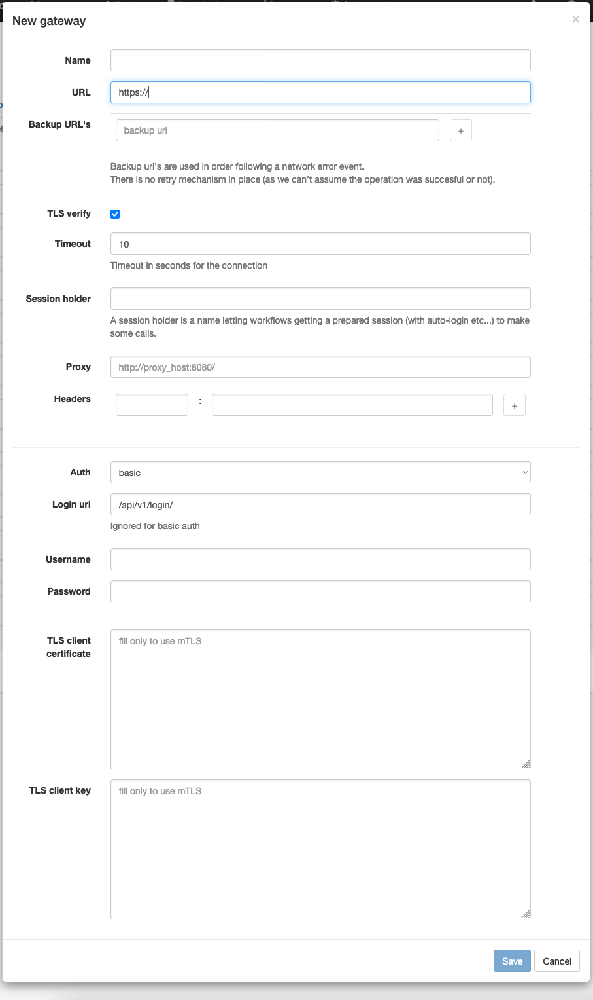

# HTTP clients (a.k.a Gateways)

APIO core engine can keep client sessions with multiple servers. Each client is identified by a unique name. The `session_holder` name is used to identify the client in the HTTP calls nodes (e.g [HTTP call node](../workflows/nodes#http-call)).

This is useful to keep the client configuration in one place and reuse it in multiple places. And efficient because it allows to reuse the same client session / connections for multiple calls across workflows.

## Health checks

If enabled, the health check is executed periodically. The health check is a simple HTTP call to the `health_check_url`. If the call fails, the client is marked as unhealthy (on the dashboard and gateways page) and backup url's may be used as failover.

:::info

Unhealthy clients are still used in the HTTP calls nodes.

:::

## Authentication methods

### OAuth1

[OAuth1](https://oauth.net/core/1.0a/) is an open standard for access delegation, commonly used as a way for Internet users to grant websites or applications access to their information on other websites but without giving them the passwords.

### OAuth2

[OAuth2](https://oauth.net/2/) is an authorization framework that enables a third-party application to obtain access to an HTTP service, either on behalf of a resource owner by orchestrating an approval interaction between the resource owner and the HTTP service, or by allowing the third-party application to obtain access on its own behalf.

Set the token URL in the `login url` attribute. The `client id` and `client secret` (or `username` and `password`) attributes are used to authenticate the client to the token URL.

### Basic

For basic authentication, use the `username` and `password` attributes.

### Bearer

For fixed bearer token, use the `headers` attribute to set the `Authorization` header. 

### Hawk

[Hawk](https://blog.mozilla.org/services/2015/02/05/whats-hawk-and-how-to-use-it/) is a HTTP authentication scheme using a message authentication code (MAC) algorithm to provide partial HTTP request cryptographic verification.

### mTLS

Mutual TLS authentication is a two-way SSL authentication that uses client certificates to authenticate the client to the server and the server to the client.

If the client `url` starts with `https://`, the client can use mTLS authentication using the `TLS client certificate` and `TLS client key` attributes (both in PEM format).

## Failover

If `backup urls` is set, the client will try to connect to the backup URLs if the main URL is not available.

Those url's are used in the order they are defined. If the first one is not available, the second one is used, and so on.

:::info

The backup URLs are used only if the main URL is not available. If the main URL is available but returns an error, the backup URLs are not used.

:::

:::caution

If an error occurs during the connection to the current URL, the client will not try to fallback to the next backup URLs for the same call. It will try to fallback to the next backup URLs only for the next calls.

:::
