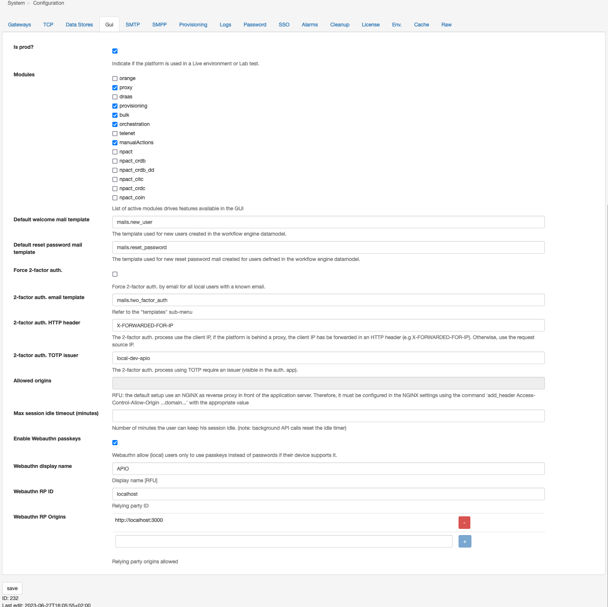

# Gui

The APIO core comes with a GUI that allows you to manage the APIO core. This GUI may hide/expose some features of the APIO core.

| Attribute | Description |
| --------- | ----------- |
| is Prod? | Whether the GUI should indicate this is a TEST or PROD environment. |
| Modules | The list of modules / pages to enable in the GUI. |
| Default welcome mail template | The default mail template used to send welcome mails when a new local user is created via API and no password is provided. |
| Default reset password mail template | The default mail template used to send reset password mails when a user requests a password reset via API. |
| Force 2-factor auth. | Whether the 2-factor *by mail* authentication should be enforced for all users with a mail address. |
| 2-factor auth. email template | The mail template used to send the 2-factor authentication code. |
| 2-factor auth. HTTP header | Use a custom HTTP header from the request to get the client source IP address (used to trust the source in the 2-factor auth. process). |
| 2-factor auth. TOTP issue | The TOTP issuer used to generate the TOTP QR code. |
| Allowed origins | The list of allowed origins for the CORS requests. |
| Max session idle timeout | The maximum time a session can be idle before being closed (in minutes). |
| Enable WebauthN passkeys | Whether the WebauthN passkeys are enabled. |
| WebauthN display name | The display name used for the WebauthN passkeys. |
| WebauthN RP ID | The relying party ID used for the WebauthN passkeys. |
| WebauthN RP origins | The list of origins allowed for the WebauthN passkeys. |