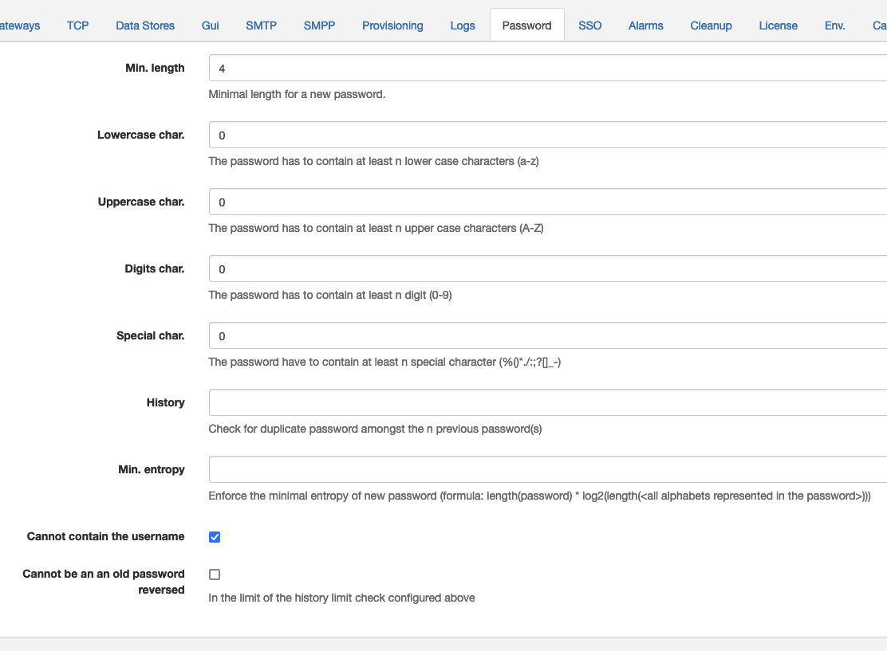

# Password

Password rules for APIO core users can be configured here.

| Attribute | Description |
| --------- | ----------- |
| Min length | The minimum length of the password. |
| Lowercase | The minimum number of lowercase characters. |
| Uppercase | The minimum number of uppercase characters. |
| Digits | The minimum number of digits. |
| Special | The minimum number of special characters. |
| History | The number of previous passwords to remember. |
| Min. entropy | The minimum entropy of the password. |
| Cannot contain the username | Whether the password can contain the username. |
| Cannot be an old password reversed | Whether the password can be an old password reversed. |