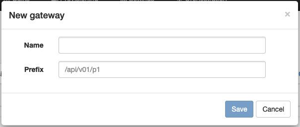

# Provisioning

When APIO core is integrated with Broadsoft (gateway(s)), it may be used to provision the Broadsoft platform via a *Provisioning ui*.

These pages use an API prefix on all their API calls to reach the correct proxy process (e.g. `/api/v01/p1/...`).

| Attribute | Description |
| --------- | ----------- |
| Name | The label of the entry in the provisioning UI menu to identify the gateway. |
| Prefix | The prefix of the API calls to reach the proxy process. |
