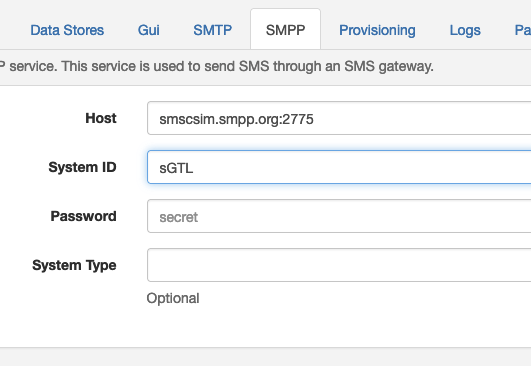

# SMPP

APIO core engine can use an SMPP server to send sms from workflows.

| Attribute | Description |
| --------- | ----------- |
| Host | The SMPP server host. |
| System ID | The SMPP server system ID. |
| Password | The SMPP server password. |
| System Type | The SMPP server system type. |
