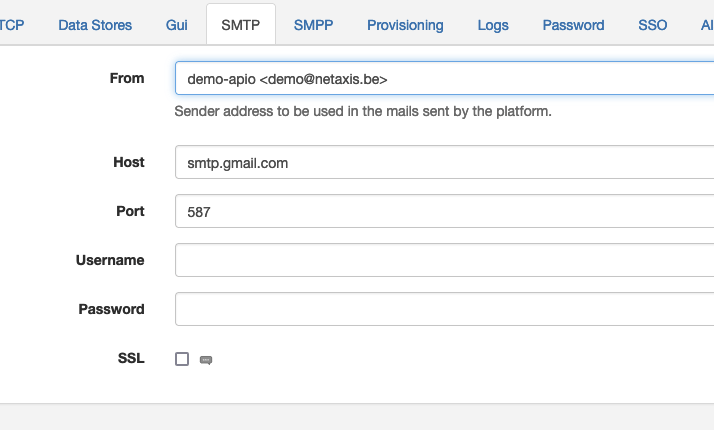

# SMTP

APIO core engine can use an SMTP server to send emails either from workflows or from internal processes (e.g. Two-Factor Authentication, reset password, etc...).

| Attribute | Description |
| --------- | ----------- |
| From | The email address used as the sender of the emails. |
| Host | The SMTP server host. |
| Port | The SMTP server port. |
| Username | The SMTP server username. |
| Password | The SMTP server password. |
| SSL | Whether the SMTP server requires TLS. |
