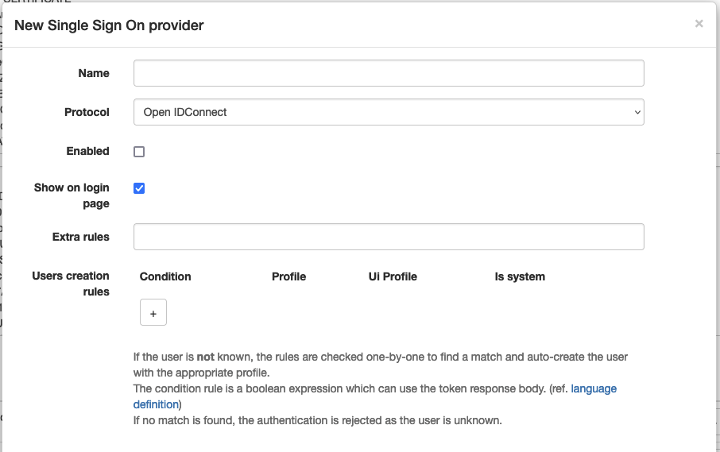
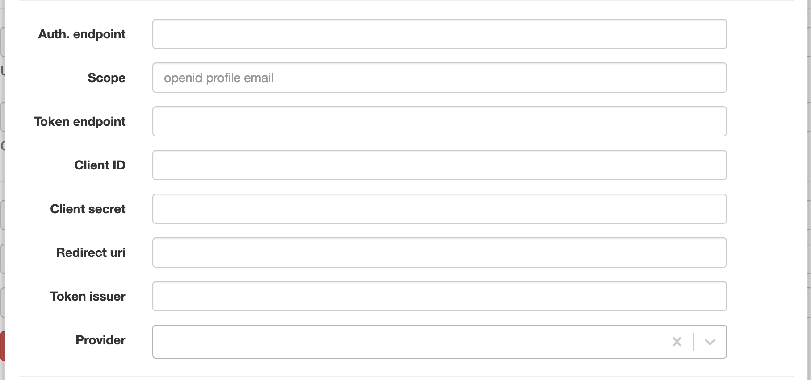
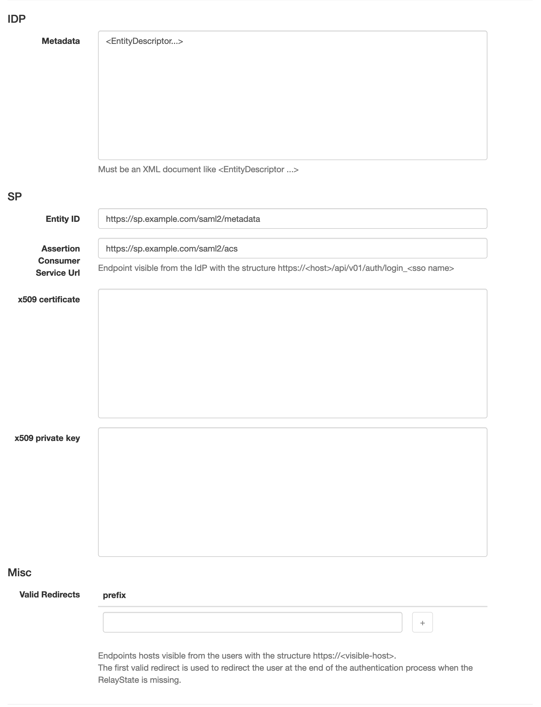
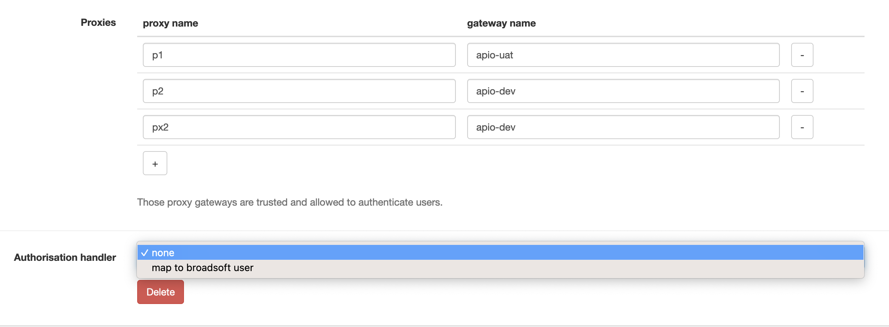

# SSO

APIO core supports SSO (Single Sign-On) via a bunch of protocols.

Single sign-on (SSO) is an authentication scheme that allows a user to log in with a single ID and password to any of several related, yet independent, software systems. True single sign-on allows the user to log in once and access services without re-entering authentication factors.

It allows users to authenticate themselves on one platform and then use the same credentials to access other platforms within the same organization. So they don't need to be provisioned or authenticated on each platform.

## Login page

The login page may display an SSO button to allow users to login via SSO if the provider entry is configured.

The button label is `Login with ` followed by the name of the provider entry.

## Extra rules

Even if the IdP accept the authentication, APIO core may reject it if the user doesn't match some extra rules. (e.g. the user is not in the correct group / organization)

The rules are simple expression based on the element of the token IdP decoded. (e.g `hd == 'mycompany.com'`)

## User creation rules

When a user is authenticated via SSO, APIO core may create the user if it doesn't exist.

The rules are a mapping between the elements of the token IdP decoded and user profiles definitions.

:::caution

If no rules exists or no rule match, the user is not created. And the authentication is rejected.

:::

## Protocols

### OpenID Connect

OpenID Connect (OIDC) is an authentication protocol built on top of OAuth 2.0 that can be used to securely sign users in to web applications.

| Attribute | Description |
| --------- | ----------- |
| Auth. endpoint | The URL of the authentication endpoint. |
| Scope | The scope of the authentication. |
| Token endpoint | The URL of the token endpoint. |
| Client ID | The client ID. |
| Client secret | The client secret. |
| Redirect URI | The redirect URI. |
| Token issuer | The issuer of the token. |
| Provider | Some specifics for certain implementation. |

### SAML

Security Assertion Markup Language (SAML) is an open standard for exchanging authentication and authorization data between parties, in particular, between an identity provider and a service provider.

| Attribute | Description |
| --------- | ----------- |
| IdP Metadata | The metadata describing the IdP. (e.g &lt;EntityDescriptor xmlns="urn:oasis:names:tc:SAML:2.0:metadata" xmlns:ds="http://www.w3.org/2000/09/xmldsig#" xmlns:shibmd="urn:mace:shibboleth:metadata:1.0" entityID="https://idp.clearlogin.co.uk"&gt;...&lt;/EntityDescriptor&gt;) |
| SP Entity ID | The entity ID of the SP. |
| SP Assertion Consumer Service URL | The URL of the SP assertion consumer service. |
| SP x509 certificate | The x509 certificate of the SP. |
| SP private key | The private key of the SP. |
| SP valid redirects | The list of valid redirects. |

:::tip

Most the details from here are available in the IdP configuration page dedicated to the application entry.

:::

### Webseal

WebSeal is a reverse proxy server that provides authentication and authorization services for a web application.

This proxy adds HTTP headers in the client traffic with the user information. (e.g. `iv-user`)

APIO core trusts these headers only if the Webseal proxy IP appears in the list of trusted source IPs.

| Attribute | Description |
| --------- | ----------- |
| HTTP header with client IP | Used to fetch the (webseal) client IP address when the instance is behind some reverse proxy. (e.g X-Real-IP) |
| Trusted source IPs | List of trusted source IPs. |

### Soap Token

Proprietary protocol used by custom company implementation of IdP.

### Broadsoft

| Attribute | Description |
| --------- | ----------- |
| Proxies | Map the proxies allowed to authenticate via this provider. And to which gateway they need to go. |
| Authorisation handler | The authorisation handler to use. When set to `map to broadsoft user`, the `Username mapping template` can be used to transform the SSO username into Broadsoft username and attributes from Broadsoft bound to the APIO core user. |
