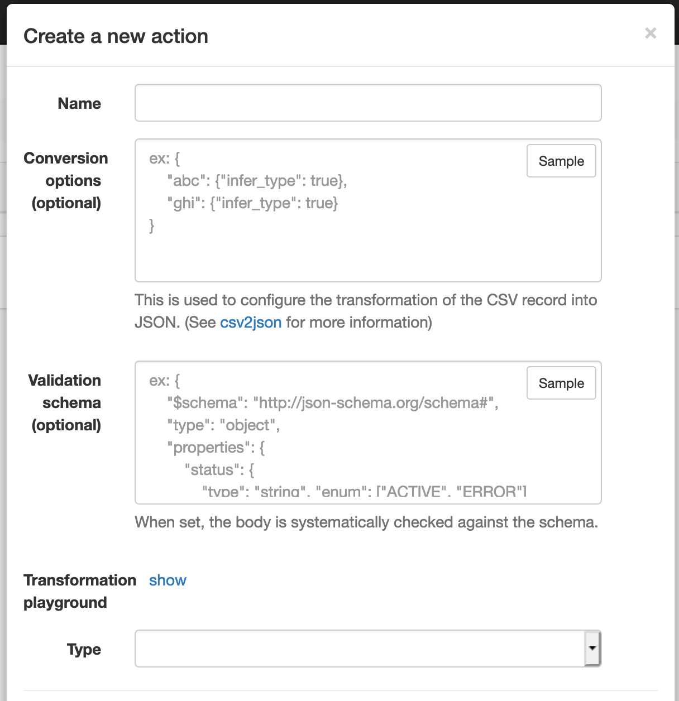

# Bulks

Bulk jobs are a way to run a workflow on a set of data. For example, you might want to send an email to all users who signed up in the last week. You can do this by creating a bulk job that runs a job on all users who signed up in the last week.

## Bulk actions

Workflows are agnostic to the trigger that starts them. This means that you can create a workflow that runs on an API custom route for a single user, and then run that workflow on a set of users using a bulk job.

A bulk action is a configuration that maps data from the bulk job to the workflow. For example, if you want to send an email to all users who signed up in the last week, you would create a bulk action that maps the user's email to the workflow's `email` input.

A bulk action has the following properties:

- **Name**: The name of the bulk action. This is used to identify the bulk action in the bulk job configuration.
- **Conversion option**: a JSON object which may customize the transformation process turning the CSV => JSON (the object is passed as is to the library [csv2json](https://github.com/rockwelln/csv2json), you may refer to it as reference documentation).
- **Validation schema**: a JSON object used to validate the JSON output of the transformation process 
- **Transformation playground**: Help the user to tailor made the transformation / validation, the playground can be used to try the "conversion options" and "validation scheme" mentioned above on a CSV sample (headers + 1 row).
- **Type**: Action to be triggered by the bulk job. Currently, only workflows are supported.

## Start a bulk job

A new bulk job can be started by providing an input data file and a bulk action. The input data file must be a CSV file with a header row. The header row and the conversion options are used to map the data to the workflow instances.

## History

:::caution

Currently, users (if they have the proper right) can see all bulk jobs, even those created by other users. This will change in the future.

:::
