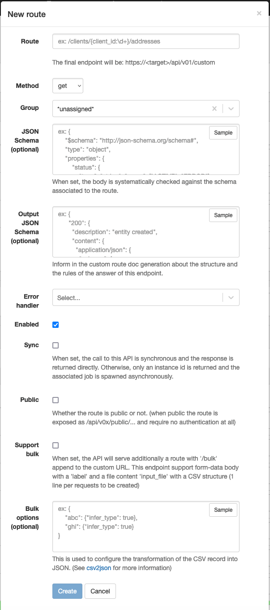

# Custom routes

APIO core supports custom HTTP routes. You can use them to expose your workflows to create your own API calls.

Page: `/transactions/config/startup_events`

### Definition



| Attribute | Description |
| --------- | ----------- |
| Route | The path of the route. |
| Method | The HTTP method of the route. |
| Group | The group of the route. |
| JSON Schema | The request body can be validated with a JSON schema before launching the workflow. |
| Output JSON Schema | The response body can be described for the OpenAPI generator. |
| Error handler | The workflow to launch when an error occurs. |
| Enabled | The route is enabled. |
| Sync | The route is synchronous. |
| Public | The route does not require authentication. |
| Support bulk | The route supports bulk requests. |
| Bulk options | The options of the bulk requests. |

## Synchronous vs Asynchronous routes

The custom routes can be synchronous or asynchronous. The synchronous routes are executed in the same thread as the HTTP request. The asynchronous routes are executed in a separate thread.

The synchronous routes are useful when the workflow is fast. The asynchronous routes are useful when the workflow is slow or long-running. In this case, the workflow can be launched in a separate thread and the HTTP request can be closed. The workflow can continue to run in the background.

When the route is asynchronous, the response is sent immediately. The response contains the ID and the GUID of the transaction. The transaction can be used to track the status of the workflow. (via the API `GET /api/v01/transactions/{id}` or via the UI `/transactions/{id}`)

### Asynchronous response sample

```json
{
    "id": 1,
    "guid": "70195486-8934-4a31-a504-a97a72c7f322"
}
```

### Synchronous response

When the route is synchronous, the response is sent when the workflow reach an [end](../workflows/nodes#end) node. The response is evaluated based on the context key `*response*` (set with a [context setter](../workflows/nodes#context-setter) node for instance).

The value has to be a JSON object with the following attributes:

| Attribute | Description |
| --------- | ----------- |
| status | The HTTP status code of the response. |
| body | The body of the response. It can be a string or a JSON object. |
| headers | A JSON object with the headers to be added in the response. |

:::tip

Because there is a match in the structure of the output of [http call nodes](../workflows/nodes#http-call) and the structure of the response of the custom routes, the http call nodes can output directly in the `*response*` context key without further processing.

:::

:::tip

If the `*response*` value is not a valid JSON object, the workflow can be closed succesfully but the response will have a status 500 (Internal Server Error).

:::

#### Samples Response

<table>
<thead>
<tr>
<th> Description </th> <th> Value of *response* key </th> <th> Response </th>
</tr>
</thead>
<tbody>
<tr>
<td>JSON response</td>
<td>

```json
{
  "status": 200,
  "body": {
    "message": "hello, world"
  }
}
```

</td>
<td>

```http
HTTP/1.1 200 OK
Content-Type: application/json

{
  "message": "hello, world"
}
```

</td>
</tr>

<tr>
<td>Plain response</td>
<td>

```json
{
  "status": 200,
  "body": "hello, world"
}
```

</td>
<td>

```http
HTTP/1.1 200 OK
Content-Type: text/plain

hello, world
```

</td>
</tr>

<tr>
<td>File attachment response</td>
<td>

```json
{
  "status": 200,
  "body": "hello, world",
  "headers": {
      "content-disposition": "attachment; filename=\"hello.txt\"",
      "content-type": "text/plain"
  }
}
```

</td>
<td>

```http
HTTP/1.1 200 OK
Content-Type: text/plain
Content-Disposition: attachment; filename="hello.txt"

hello, world
```

</td>
</tr>

</tbody>
</table>


## Authenticated routes

By default, all custom routes are authenticated. The authentication is done using the JWT token. The JWT token is added to the `Authorization` header (Bearer [authentication scheme](https://developer.mozilla.org/en-US/docs/Web/HTTP/Authentication)) of the HTTP requests.

Such routes are exposed under the `/api/v01/custom` path. For example, the route `/my-route` is exposed as `https://api.example.com/api/v01/custom/my-route`.

## Public routes

The custom routes can be public. In this case, they do not require authentication. Such routes are exposed under the `/api/v01/public` path. For example, the route `/my-route` is exposed as `https://api.example.com/public/my-route`.

Public routes are useful when you want to expose your workflows to external systems in a secure environment. (e.g. a private network or health check)

## Proxied routes

APIO core can be deployed with one or several proxies to intercept and/or forward some traffic to a Broadsoft gateway (Netaxis product). In this case, the proxy process will use the custom routes to *overload* or *extend* the Broadsoft gateway API calls.

Proxied routes are usually exposed under the `/api/v01/p{id}` path. For example, the route `/my-route` is exposed as `https://api.example.com/api/v01/p1/my-route`.

All proxied routes require the user to be authenticated.

:::caution

Proxied routes (not overloaded by custom routes) are executed with different user sessions depending of the originating user:

* The user is a Broadsoft user, the route is executed with the user session.
* The user is an APIO user, the user profile is used to allow or deny the execution of the route. If the user profile is allowed to execute the route, the route is executed with the system level session.

There is no risk of impersonation because the user session is always used for Broadsoft users.

:::

Some nodes are especially usefull in the context of the proxied routes, e.g. [Proxy user session](../workflows/nodes/#broadsoft-proxy-session-call) node, to use the user session to make calls to the Broadsoft gateway.

### API documentation

The Broadsoft gateway API is described [here](https://apio-docs.bxl.netaxis.be/).

:::caution

The documentation mention paths with a prefix `/api/v1` but ther are exposed under the `/api/v01/p{id}` path on the proxy.

e.g `/api/v1/tenants/` is exposed at `/api/v01/p{id}/tenants/`.

:::

## Documentation

The custom routes are documented in the OpenAPI generated specification. The specification is available at the `/api/v01/custom_routes.swagger.yml` path. For example, `https://api.example.com/api/v01/custom_routes.swagger.yml`.
