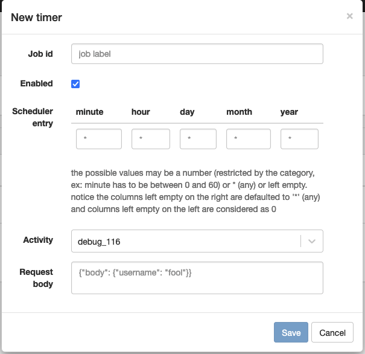

# Scheduled jobs

A scheduled job is a job that is executed periodically. It is used to execute a task periodically. (e.g reporting, data synchronization, etc.)

:::info

Scheduled jobs have no owner user. They are executed by the system.

:::

## Definition

| Attribute | Description |
| --------- | ----------- |
| Job id | The id of the job. It is used to identify the job. |
| Enabled | If the job is enabled, it will be executed periodically. |
| Scheduler entry | The expression that defines when the job is executed. |
| Activity | The activity that is executed by the job. |    
| Request body | The request body of the activity. |
