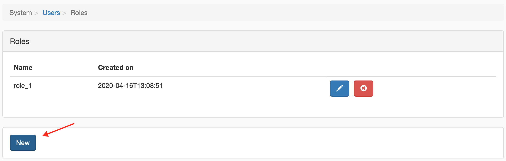
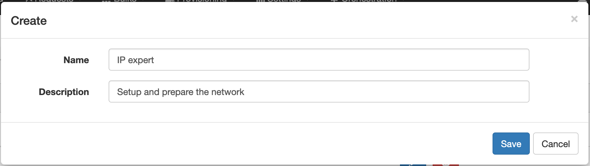
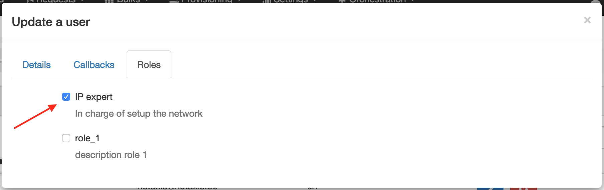
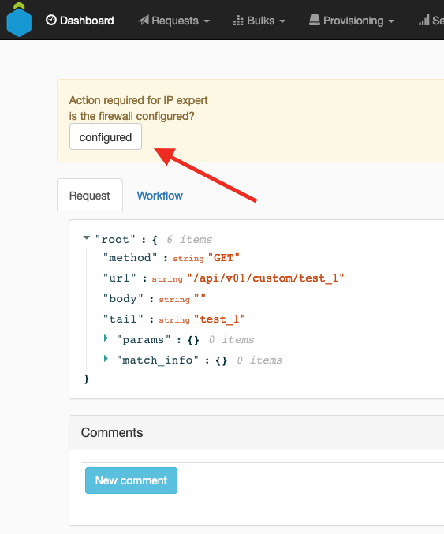
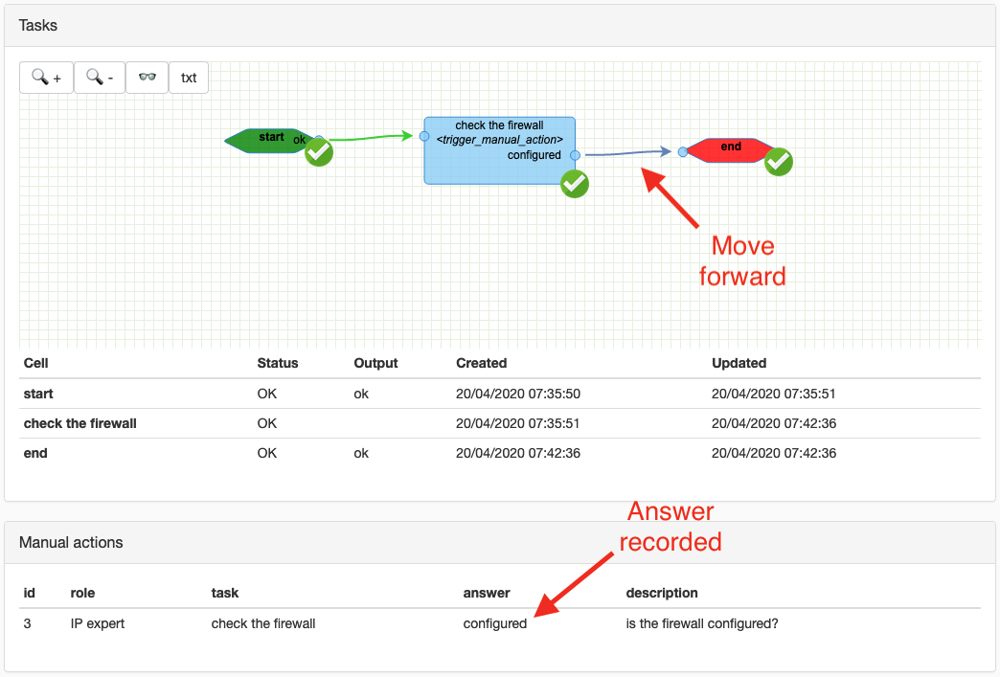

# Manual actions

Manual actions are used to pause the workflow and wait for a user to perform an action.
It might be a approval before accepting an order, or a manual check of a document.

A manual action is always assigned to a group of users with a certain role.

## Configuration

### Define a user role

In the page `System > Users > Roles` you can define a new role.




### Assign the role to a user

In the user details, go to the tab 'Roles'.




### Add a manual action to your workflow

Use the node [manual action](../nodes#trigger-manual-action) with the appropriate role.

The node can be configured to send a mail notification to users with that role when the action is triggered.

## Usage

When the workflow reaches the manual action, it will pause and wait for a user with the appropriate role to perform the action.

:::tip

Because the manual actions are asynchronous by nature, it's recommended to not link that workflow to a synchronous route / process.

:::

### Trigger the action

The action can be triggered in two ways:

* By clicking on the button in the workflow details page



* By clicking a link (or a button) which route the user to perform the action

This requires the user to be authenticated and allowed to perform the action.

The link has to have the following format:

```
https://<your-domain>/transactions/<instance-id>/action/<action-id>?output=<answer>
```

When the action is triggered, the workflow will continue. The action is marked as completed and the user who triggered the action is recorded.



## Actions for not-authenticated users

Sometimes, you might want to allow not-authenticated users to perform an action.

In that case, the workflow has to first [generate an ott](../nodes#generate-ott) for a manual action and link it the manual action node with the `link_ott_context_key` field.

Then, the link to trigger the action has to be generated with the following format:

```
https://<your-domain>/api/v01/transactions/manual_actions?output=<answer>&ott=<ott>
```

When the action is triggered, the workflow will continue. The action is marked as completed.

:::caution

OTT have to be used with caution as they are not authenticated and can be used by anyone.

:::
