# Nodes

Nodes are the building blocks of a workflow (a.k.a cells).

## Start

Technical name: `start`

Every workflow must have one and only one start node.

This is a technical node which has no attributes.

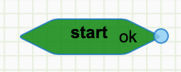

## End

Technical name: `end`

Mark the end of a workflow.

A workflow has to contain at least one end node. But it can have more than one end node.
Especially in `macro` workflows, it is common to have multiple end nodes with names named after possible outputs.


## Generic node

Except a very few of them, nodes have a generic representation.

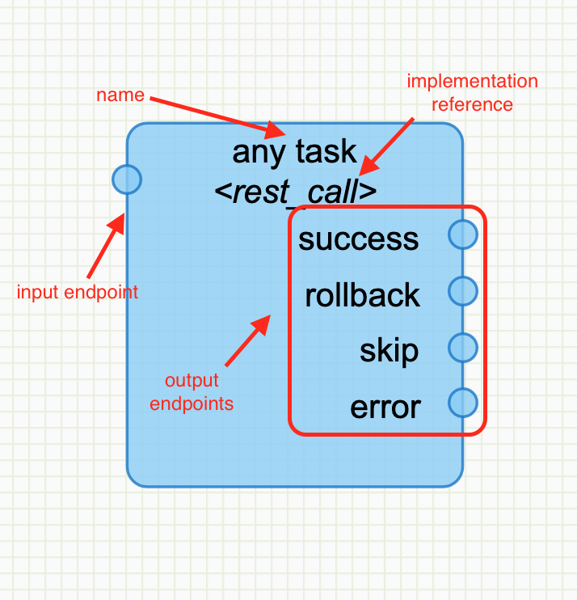

## HTTP call

Technical name: `http_call`

Execute an HTTP call and assign the result to a context variable.

The call can be executed on a *session holder* (defined in the configuration and using a relative url) or on a new session (using a full URL, e.g `http://example.com/api/users`).

The result of the call is a dictionary with the following keys:

- `status`: The HTTP status code of the response.
- `body`: The body of the response.

The result of the call is assigned to the context variable defined in the `output_context_key` attribute.

It can also be assigned to a cache key if the `cache_key` attribute is defined.
If the HTTP method is `GET`, the result will be cached and the cache will be used for subsequent calls. If the HTTP method is not `GET`, the cache will be invalidated.

:::caution

If the returned status code is not in the `http_codes` attribute, and the `error` output is not linked to another node, the node will fail.

:::

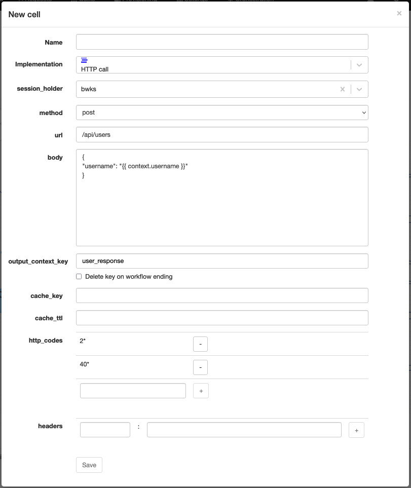

| Attribute | Description |
| --- | --- |
| session_holder | The session holder to use. |
| method | The HTTP method to use. |
| url | The URL to call. |
| body | [optional] The body of the request. |
| output_context_key | The context variable to assign the result to. |
| cache_key | [optional] The cache key to use. |
| cache_ttl | [optional] The cache timeout to use. |
| http_codes | [optional] The HTTP codes to consider as outputs of the nodes. <br /> The `*` can be used to include multiple codes. |
| headers | [optional] Extra headers of the request. |

## REST call

Technical name: `rest_call`

Legacy node. It behave exactly like `http_call` but it extracts a special attribute `_record_internal_id` from the response body (this is a special case for Broadsoft gateway to link with its internal audit record for debugging).

<b>Prefer [http_call](#http-call) when possible.</b>

## JSON call (deprecated)

Technical name: `json_call`

<b>use [http_call](#http-call) instead.</b>

## Asynchronous JSON call

Technical name: `async_json_call`

Execute an HTTP call with a JSON body, possibly parse its response into an object dictionary and waits for a callback to be sent with an ID matching a value present in the synchronous response.

The call can be executed on a *session holder* (defined in the configuration and using a relative url) or on a new session (using a full URL, e.g `http://example.com/api/users`).

The workflow is paused until the callback is received or the timeout is reached.

:::info

The callback needs to be sent as such:

``` http
POST /api/v01/transactions/callbacks/:callback_id HTTP/1.1
{
    ...
}
```

:::

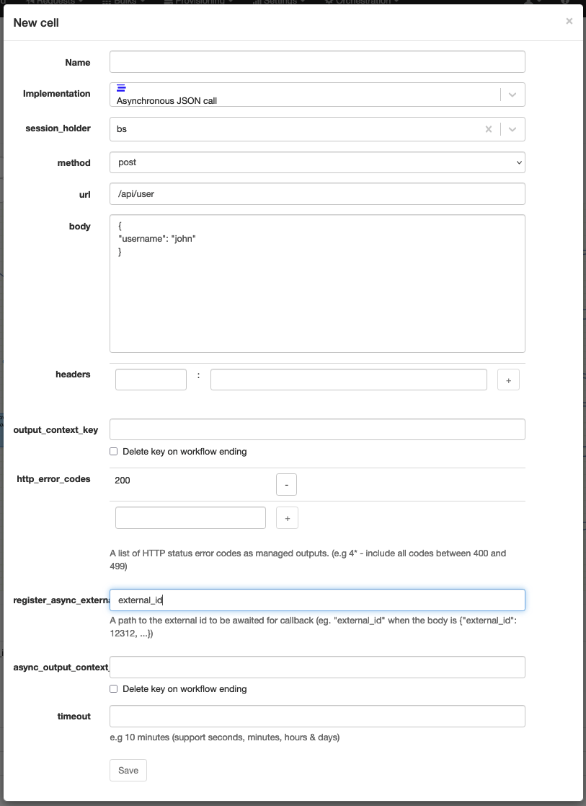

| Attribute | Description |
| --- | --- |
| session_holder | The session holder to use. |
| method | The HTTP method to use. |
| url | The URL to call. |
| body | The JSON body of the request. |
| headers | [optional] Extra headers of the request. |
| output_context_key | The context variable to assign the result to. |
| http_error_codes | [optional] The HTTP codes to consider as outputs of the nodes. <br /> The `*` can be used to include multiple codes. |
| register_async_external_id | Path to the external id to be expected in the callback (e.g "external_id" if the body of the synchronous response call is `{"external_id": "123465"}`) |
| async_output_context_key | The context variable to assign the result of the callback to. |
| timeout | [optional] The timeout of the asynchronous call. |

## XML call

Technical name: `xml_call`

Execute an HTTP call with an XML body and parse its response into an object dictionary (possibly) and assign the result to a context variable.

The call can be executed on a *session holder* (defined in the configuration and using a relative url) or on a new session (using a full URL, e.g `http://example.com/api/users`).

The result of the call is a dictionary with the following keys:

- `status`: The HTTP status code of the response.
- `body`: The body of the response.

It can also be assigned to a cache key if the `cache_key` attribute is defined. If the HTTP method is `GET`, the result will be cached and the cache will be used for subsequent calls. If the HTTP method is not `GET`, the cache will be invalidated.

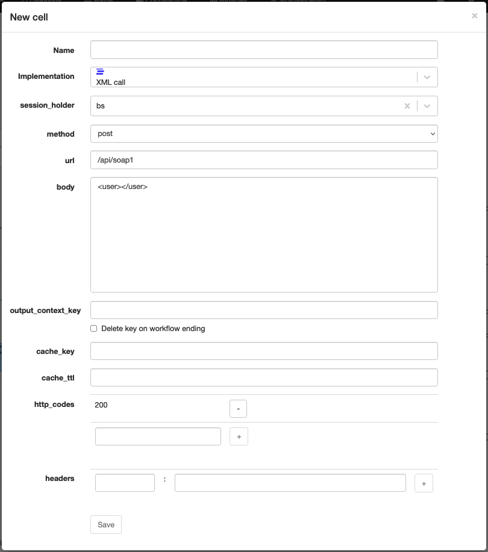

| Attribute | Description |
| --- | --- |
| session_holder | The session holder to use. |
| method | The HTTP method to use. |
| url | The URL to call. |
| body | The XML body of the request. |
| output_context_key | The context variable to assign the result to. |
| cache_key | [optional] The cache key to use. |
| cache_ttl | [optional] The cache timeout to use. |
| http_codes | [optional] The HTTP codes to consider as outputs of the nodes. <br /> The `*` can be used to include multiple codes. |
| headers | [optional] Extra headers of the request. |

## Broadsoft XSP / ADP call (experimental)

Technical name: `bsft_call`

Execute a Broadsoft XSP / ADP call using the OCI protocol and assign the result to a context variable.

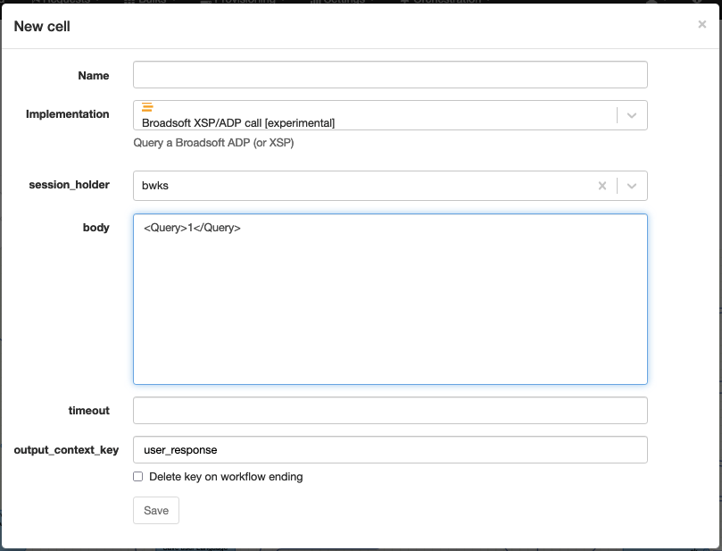

| Attribute | Description |
| --- | --- |
| session_holder | One of the TCP session holders set in the configuration |
| body | The OCI body command to be sent. (do not set the "echo" attribute, it will be generated) |
| timeout | [optional] The timeout of the query. |
| output_context_key | The context variable to assign the result to. |

## Broadsoft proxy session call

Technical name: `proxy_session_call`

Execute a call on a Broadsoft gateway using the instance owner session.

This node is meant to be executed on a Core instance running with a proxy mapping set.
So the Broadsoft gateway will be called using this mapping.

:::tip

When the session holder has the value "original user or system", the call will be executed using the original user session if it exists, otherwise it will be executed using the system session.
So the call will fail if the original user session is not allowed to do the call, it will not fallback to the "system" level session.

:::

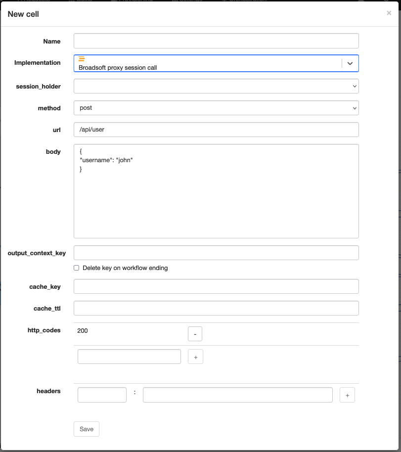

| Attribute | Description |
| --- | --- |
| session_holder | The directive to pick the right session: <br /> * system: use the system level session <br /> * original user or system: use the user session if it exists or the system level session <br /> * original user or fail: use the user session if it exists or the node fails |
| method | The HTTP method to use. |
| url | The URL to call. |
| body | The body of the request. |
| output_context_key | The context variable to assign the result to. |
| cache_key | [optional] The cache key to use. |
| cache_ttl | [optional] The cache timeout to use. |
| http_codes | [optional] The HTTP codes to consider as outputs of the nodes. <br /> The `*` can be used to include multiple codes. |
| headers | [optional] Extra headers of the request. |

## Proxy HTTP call

Technical name: `proxy_call`

Forward an HTTP call to another URL o an session holder.

The result of the call is a dictionary with the following keys:

- `status`: The HTTP status code of the response.
- `body`: The body of the response.

It can also be assigned to a cache key if the `cache_key` attribute is defined. If the HTTP method is `GET`, the result will be cached and the cache will be used for subsequent calls. If the HTTP method is not `GET`, the cache will be invalidated.

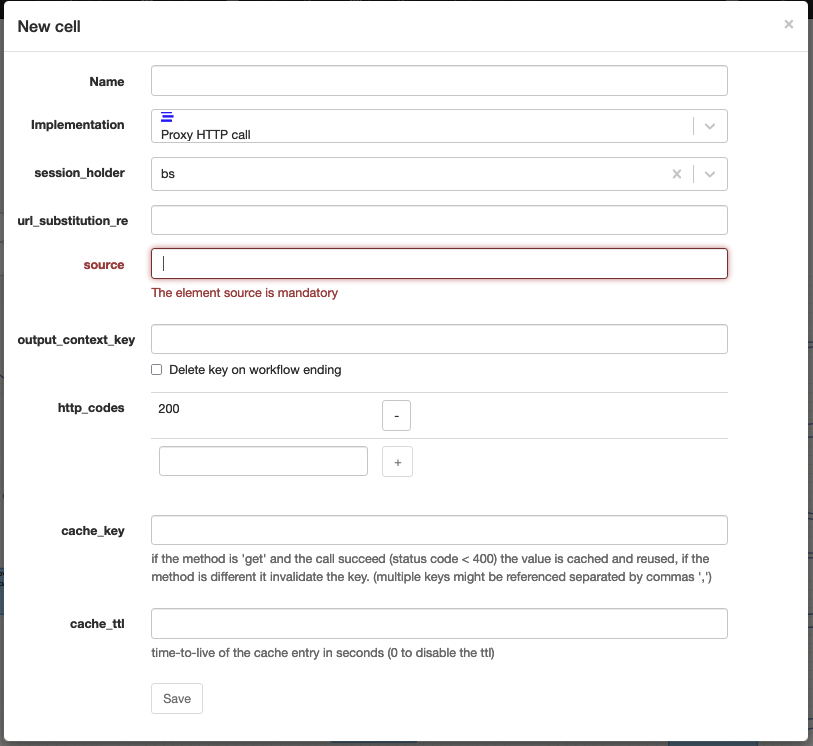

| Attribute | Description |
| --- | --- |
| session_holder | The session holder to use. |
| url_substitution_re | A regular expression to replace the URL. |
| source | The source object of the call, usually `{{ request }}`. <br /> The source element needs to contain the following keys: <br /> * url <br /> * method <br /> * [optionally] content_type |
| output_context_key | The context variable to assign the result to. |
| http_codes | [optional] The HTTP codes to consider as outputs of the nodes. <br /> The `*` can be used to include multiple codes. |
| cache_key | [optional] The cache key to use. |
| cache_ttl | [optional] The cache timeout to use. |

## TCP call (experimental)

Technical name: `tcp_call`

Execute a TCP call and assign the result to a context variable.

The body is a string that will be sent to the TCP server.

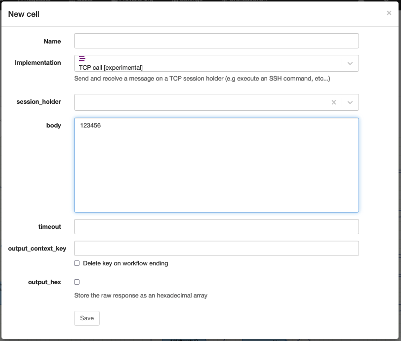

| Attribute | Description |
| --- | --- |
| session_holder | One of the TCP session holders set in the configuration |
| body | The body to be sent. |
| timeout | [optional] The timeout of the query. |
| output_context_key | The context variable to assign the result to. |
| output_hex | Whether the output should be converted to hexadecimal in the result. |

## Context setter

Technical name: `context_setter`

Set a context variable to a value.

If the key already exists, it will be overwritten.

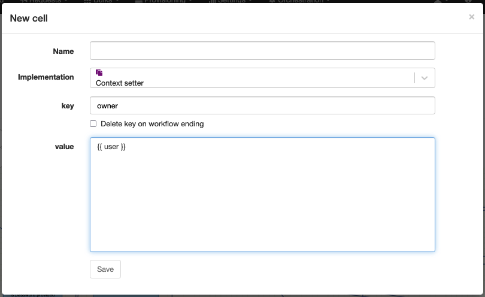

| Attribute | Description |
| --- | --- |
| key | The context variable to set. |
| value | The value to set. |

## Multiple context setter

Technical name: `multi_context_setter`

Set multiple context variables to values at once.

If a key already exists, it will be overwritten.

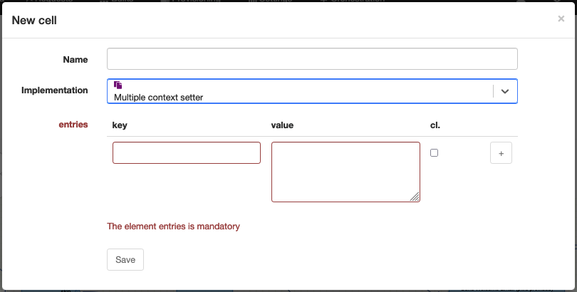

| Attribute | Description |
| --- | --- |
| entries | A dictionary of values to set. |

## Synchronous response

Technical name: `sync_response`

Set the response of the synchronous call.

Internally, it behaves like the [Context setter](#context-setter), but sets the `*sync_response*` context variable. This variable is used by the synchronous call to set the response.

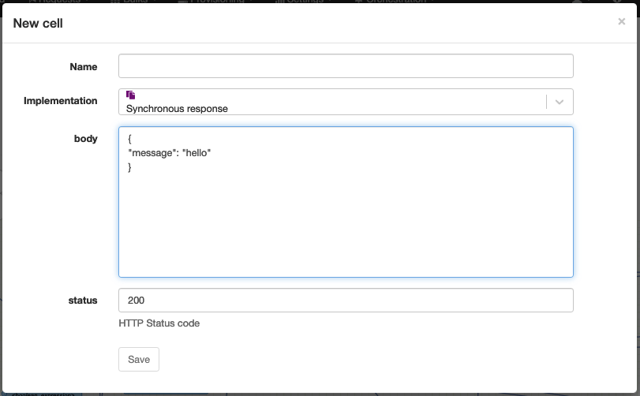

| Attribute | Description |
| --- | --- |
| body | The body of the response. If it starts with `[` or `{`, the node assumes the body is a JSON string, otherwise it's a raw string. |
| status | The status code of the response. |

## Callback response

Technical name: `callback_response`

Set the response / result of a sub-workflow as a callback to its parent workflow.

Internally, it behaves like the [Context setter](#context-setter), but sets the `*cb_response*` context variable. This variable can be used in the context of the parent workflow.

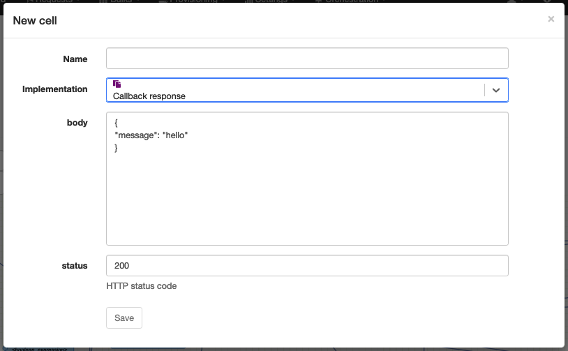

| Attribute | Description |
| --- | --- |
| body | The body of the response. If it starts with `[` or `{`, the node assumes the body is a JSON string, otherwise it's a raw string. |
| status | The status code of the response. |

## Trigger manual action

Technical name: `trigger_manual_action`

Trigger a manual action.

The manual actions will pause the workflow until the user executes the action.

The request detail page will display the manual actions that are waiting for a user action. And let the user execute them.

A manual action is usually associated to a user role. So only users with the role will be able to execute the action. A mail can be sent to the users with that role when the action is triggered.

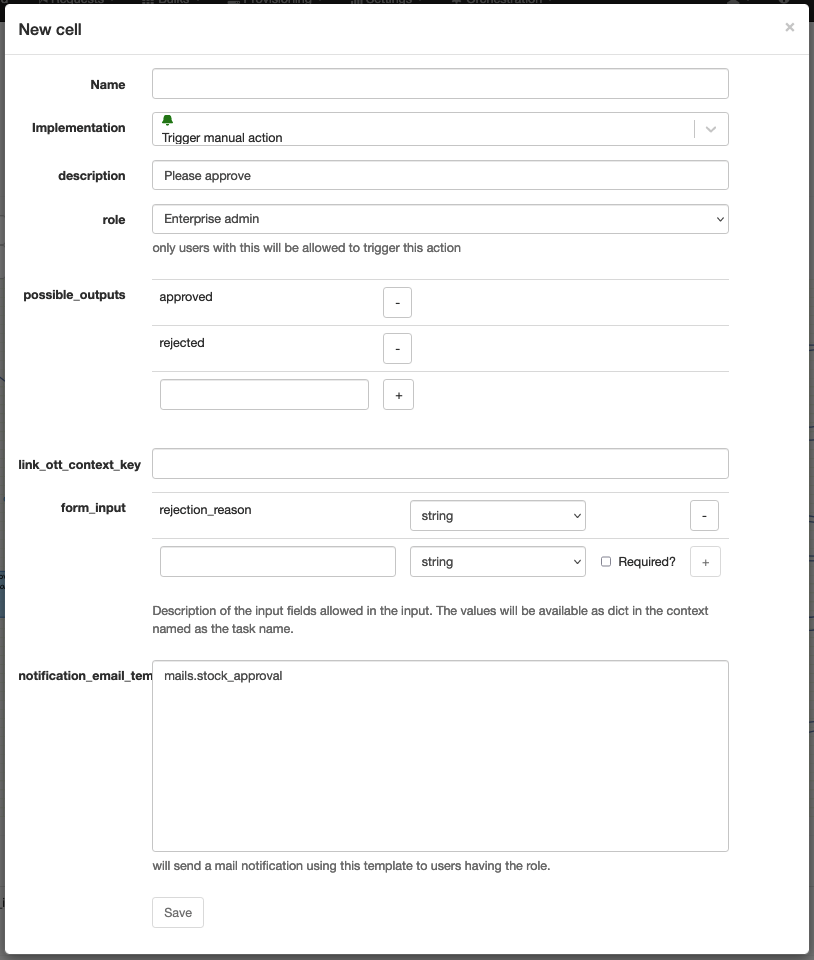

| Attribute | Description |
| --- | --- |
| description | The description of the manual action. |
| role | The role of the users that can execute the action. |
| possible_outputs | The possible outputs of the action. |
| link_ott_context_key | [optional] The context variable to link one-time token to. |
| form_input | [optional] a set of fields to be filled by the user when executing the action. |
| notification_email_template | [optional] The mail template to send to the users with the role. |

See the [manual actions](advanced/manual_actions) section for more details about the setup and the usage.

## Cancel manual action

Technical name: `cancel_manual_action`

Cancel a manual action.

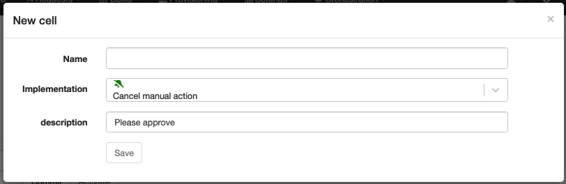

| Attribute | Description |
| --- | --- |
| description | The description of the manual action to cancel. |

## Send email

Technical name: `send_email_template`

Send a mail using a template.
The template is resolved in the context of the instance.

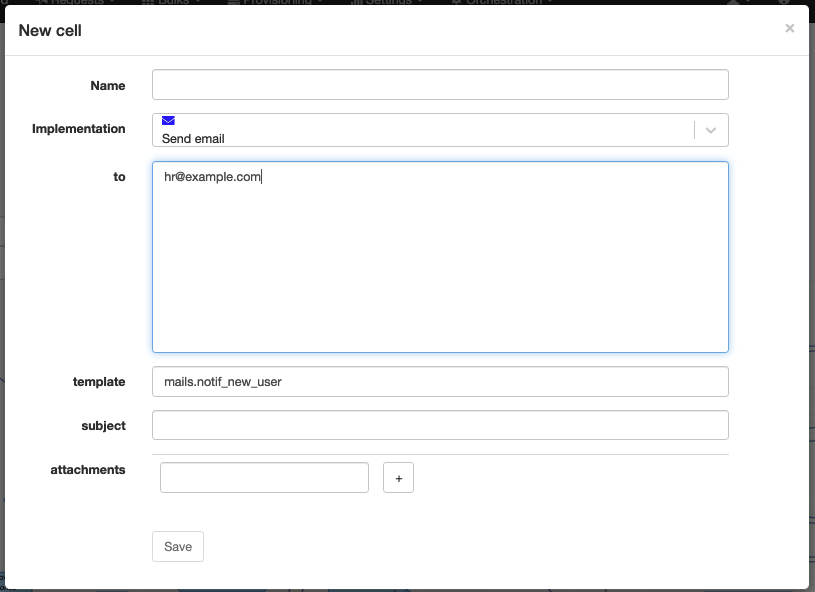

| Attribute | Description |
| --- | --- |
| to | The destination list of the mail. |
| template | The template to use. |
| subject | [optional] The subject of the mail. |
| attachments | [optional] A list of attachments to add to the mail. These are documents created or managed in the context of the instance. |

## Send SMS

Technical name: `send_sms`

Send an SMS using the SMPP gateway configured in the configuration.

The body is a template resolved in the context of the instance.


| Attribute | Description |
| --- | --- |
| from | The sender of the SMS. |
| to | The destination list of the SMS. |
| template | The template body of the SMS. |

## SQL Select

Technical name: `sql_select`

Execute a SQL query and assign the result to a context variable.

:::danger

For security reasons, it's highly recommended to use variables in the query instead of directly using the `query` attribute (avoid SQL injections with improper inputs).

:::

The result of the query is a list of rows. Each row is a dictionary with the column names as keys.

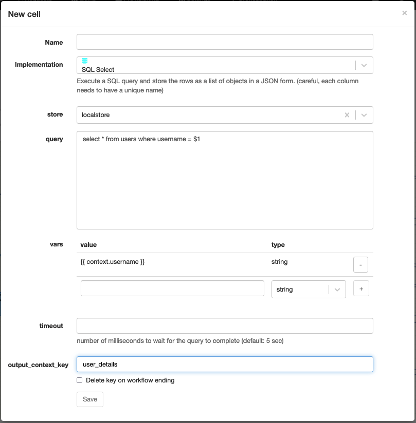

| Attribute | Description |
| --- | --- |
| store | The datastore to use. |
| query | The SQL query to execute. |
| vars | [optional] A list of variables to use in the query. |
| timeout | [optional] The timeout of the query. |
| output_context_key | The context variable to assign the result to. |

## SQL Exec

Technical name: `sql_exec`

Execute an SQL query which has nothing in the response.

:::danger

For security reasons, it's highly recommended to use variables in the query instead of directly using the `query` attribute (avoid SQL injections with improper inputs).

:::

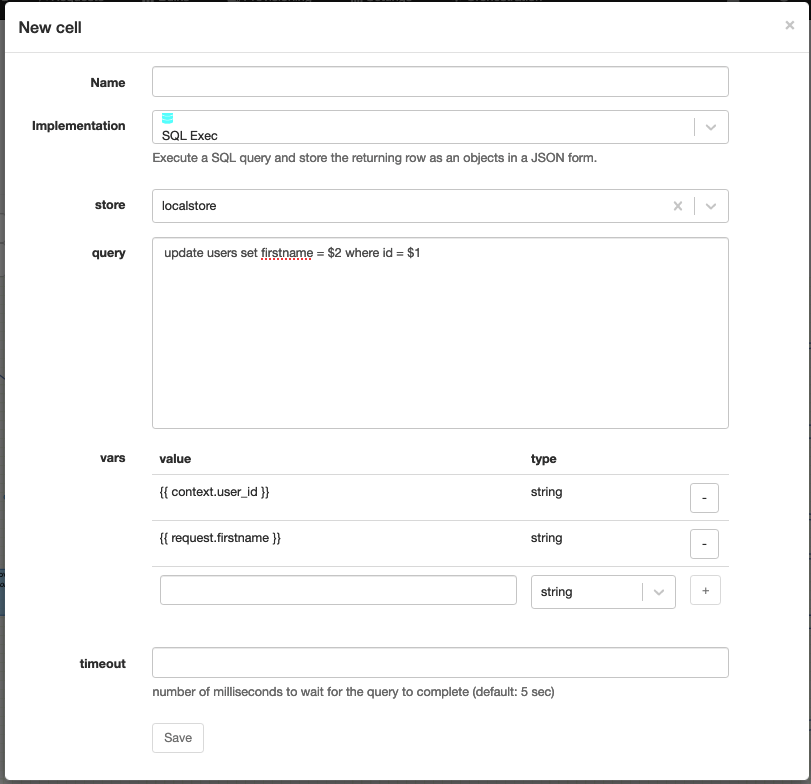

| Attribute | Description |
| --- | --- |
| store | The datastore to use. |
| query | The SQL query to execute. |
| vars | [optional] A list of variables to use in the query. |
| timeout | [optional] The timeout of the query. |

## SQL Exec with return

Technical name: `sql_exec_with_return`

Execute an SQL query and fetch its returning data.

:::danger

For security reasons, it's highly recommended to use variables in the query instead of directly using the `query` attribute (avoid SQL injections with improper inputs).

:::

The result of the query is a JSON object with columns as keys.

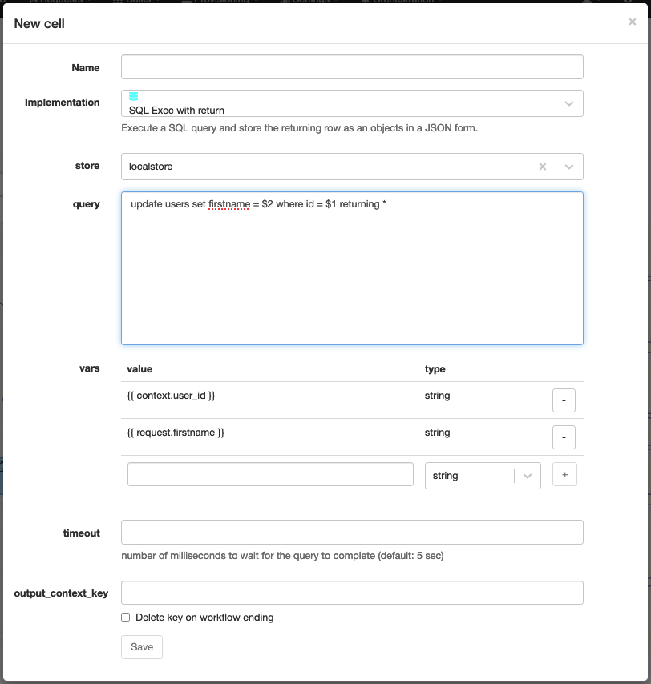

| Attribute | Description |
| --- | --- |
| store | The datastore to use. |
| query | The SQL query to execute. |
| vars | [optional] A list of variables to use in the query. |
| timeout | [optional] The timeout of the query. |
| output_context_key | The context variable to assign the result to. |

## Boolean expression

Technical name: `boolean_expression`

Evaluate a boolean expression and trigger a different path depending on the result (true or false).

:::info

Boolean expression is evaluated in the context of the current request as Jinja2 template *and* Python3 expression.

:::

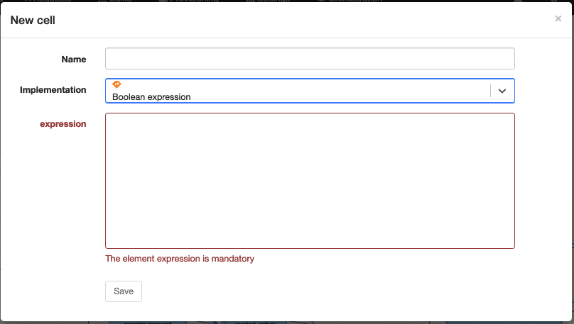

| Attribute | Description |
| --- | --- |
| expression | The boolean expression to evaluate. |

## Switch

Technical name: `switch`

Execute a different path depending on the evaluation of a set of conditions.

Conditions are boolean expressions resolved in order. The first condition which evaluates to true will be executed.
If no condition evaluates to true, the "default" path will be executed.

:::info

Boolean expressions are evaluated in the context of the current request as Jinja2 templates *and* Python3 expressions.

:::

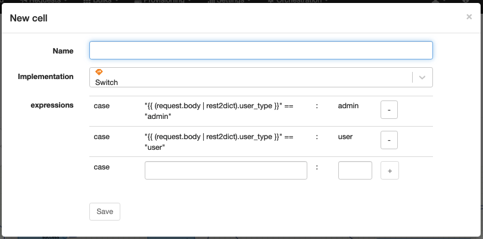

| Attribute | Description |
| --- | --- |
| expressions | A list of boolean expressions to evaluate. |

## Or

Technical name: `or_outputs`

Wait for one of the inputs to be executed before continuing the workflow. Only one input will pass through the node and continue the execution.

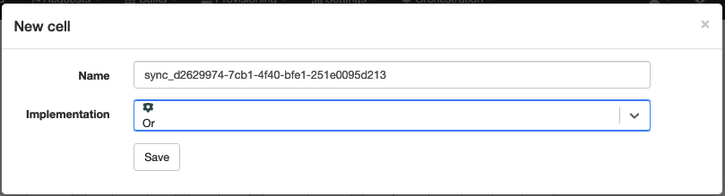

## Join

Technical name: `sync_outputs`

Wait for multiple inputs to be executed before continuing the workflow. All inputs must be executed before the workflow can continue.

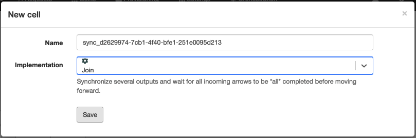

## Timer

Technical name: `timer`

Wait for a certain amount of time. If the timer is shorter than 20s it will be executed synchronously. Otherwise it will be executed asynchronously. When the timer is synchronous, it can't be stopped.

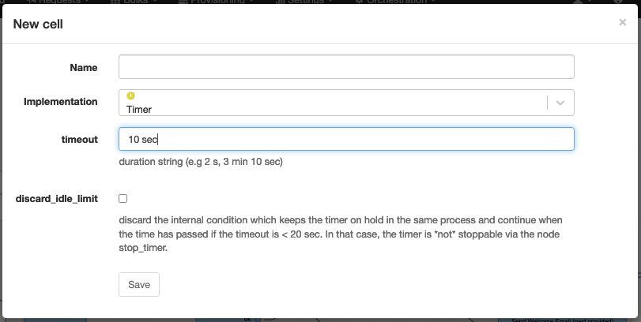

| Attribute | Description |
| --- | --- |
| timeout | The duration of the timer. <br /> This is a string representing a duration (e.g 2 sec, 3 min). |
| discard_idle_limit | Discard the internal behaviour to keep the timer synchronous if the timeout is less than 20s. |

## Context timer

Technical name: `context_timer`

Use a context variable to define the start and the duration of the timer.

:::tip

Multiple timers can be started with the same key. If a timer is started with the same key as an active timer, the active timer can be cancelled.

:::

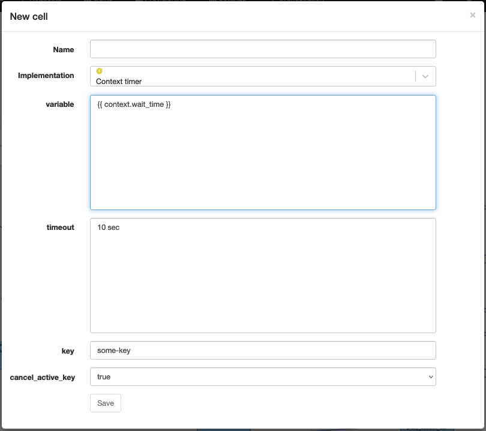

| Attribute | Description |
| --- | --- |
| variable | The start of the timer. <br /> This is a string representing a date (e.g 2021-01-01 00:00:00). |
| timeout | The duration of the timer. <br /> This is a string representing a duration (e.g 2 sec, 3 min). |
| key | [optional] A timer key identifier |
| cancel_active_key | Whether to cancel active timers with the same key. |

## Stop timer

Technical name: `stop_timer`

Stop a timer.

## Generate OTT

Technical name: `generate_ott`

Generate a one-time token and assign it to a context variable. One-time token are useful to generate a link to an action which can only be used once (e.g reset a user password).

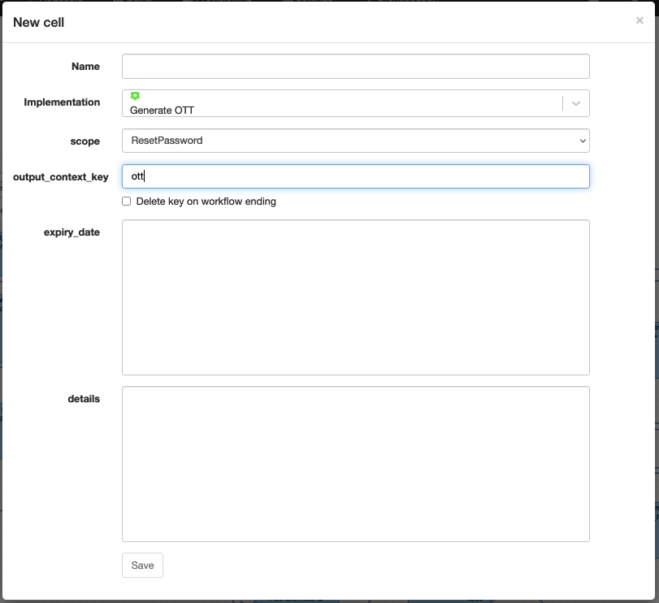

| Attribute | Description |
| --- | --- |
| scope | The scope of the generated one-time token. <br /> This is a string which is used to identify the action to perform. (a manual action, a reset password etc...) |
| output_context_key | The context variable to assign the generated one-time token to. |
| expiry_date | [optional] The expiry date of the generated one-time token. <br /> This is a time duration. It can a be a number (interpreted as a number of seconds) or it's parsed using [time.ParseDuration](https://pkg.go.dev/time#ParseDuration). |
| details | [optional] Additional details to store with the generated one-time token. <br /> This is a JSON object. |

:::tip

The default expiry date for reset password one-time token is 20 minutes.

:::

## Generate random string

Technical name: `generate_random_string`

Generate a random string and assign it to a context variable.

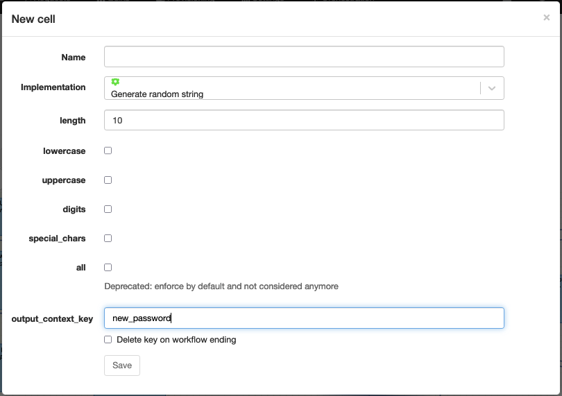

| Attribute | Description |
| --- | --- |
| lowercase | Whether to include lowercase characters in the generated string. |
| uppercase | Whether to include uppercase characters in the generated string. |
| digits | Whether to include digits in the generated string. |
| special_chars | Whether to include special characters in the generated string. |
| length | The length of the generated string. |
| output_context_key | The context variable to assign the generated string to. |

## Set Request status

Technical name: `set_request_status`

Assign a status to the current request.

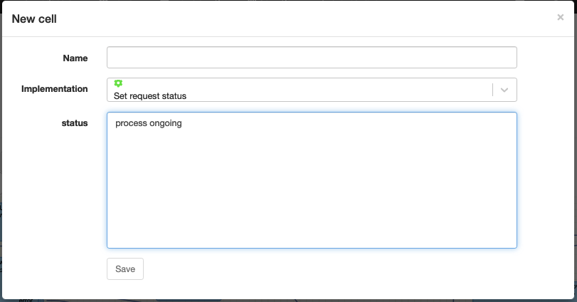

| Attribute | Description |
| --- | --- |
| status | The status to assign to the current request. |

## Set task status

Technical name: `set_task_status`

Change the status of a task. This is useful to mark a task in error and allow the user to replay a certain task in the workflow.

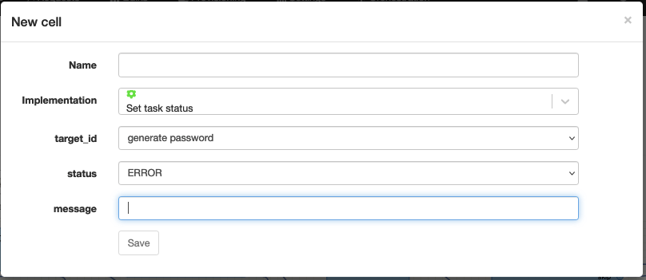

| Attribute | Description |
| --- | --- |
| target_id | The name of the task to change the status of. |
| status | The status to assign to the task. (ERROR or OK) |
| message | The error description. |

## Macro

Technical name: `macro`

Execute a subworkflow on a single input.

The name of the [end](#end) node of the subworkflow will be used as the output of the macro node.

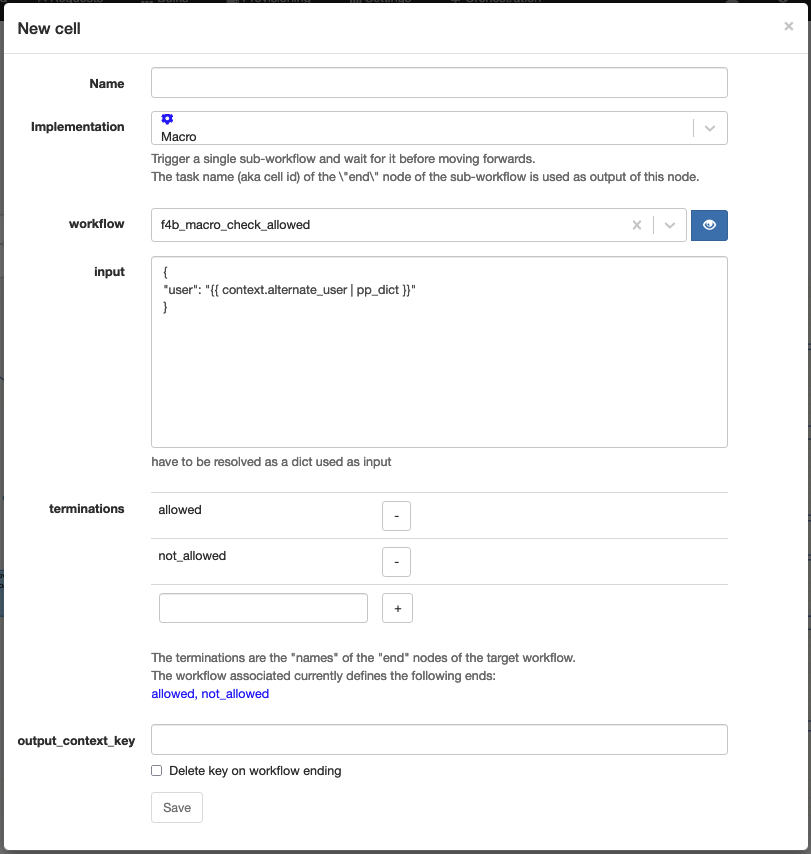

| Attribute | Description |
| --- | --- |
| workflow | The subworkflow to execute. |
| input | The input to pass to the subworkflow as `request`. |
| terminations | The possible 'end' of the subworkflow as outputs of the macro node. |
| output_context_key | The context variable to assign the output of the subworkflow to. (read, the value of the context key `*cb_response*` set by the subworkflow) |

## Subworkflow

Technical name: `trigger_subworkflows`

Execute multiple subworkflows on a list of inputs.

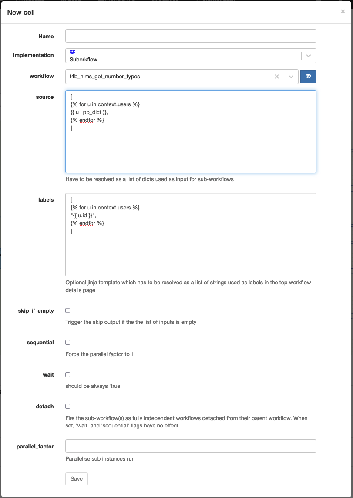

| Attribute | Description |
| --- | --- |
| workflow | The subworkflow to execute. |
| source | The list of inputs to pass to the subworkflow as `request`. |
| labels | [optional] The labels to assign to the subworkflow. <br/> If set, the number of labels has to perfectly match the number of inputs in the `source`. <br/> If it isn't, a simple incremental counter is used as label |
| skip_if_empty | Whether to use the `skip` output if the `source` is empty. |
| sequential | force the `parallel_factor` to 1. So it executes workflow in order 1-by-1. |
| wait | [deprecated] no effect. |
| detach | [deprecated] no effect. |
| parallel_factor | The number of subworkflows to execute in parallel. |

## Create user

Technical name: `create_user`

Create a new user locally on the system.


| Attribute | Description |
| --- | --- |
| username | The username of the new user. |
| email | The email address of the new user. |
| firstname | The first name of the new user. |
| lastname | The last name of the new user. |
| mobile | The mobile number of the new user. |
| ui_profile | The UI profile of the new user. <br /> This only influence the view of the user in the APIO core UI. |
| profile_id | The profile of the new user. <br /> This is the profile of the user in the APIO core engine. |
| properties | The properties of the new user. <br /> This is a JSON object. |
| user_id_context_key | The context variable to assign the user ID to. |
| password_context_key | The context variable to assign the password to. |
| auth_backend | The authentication backend to use. <br /> This is the name of the authentication backend as defined in the APIO core configuration. |
| entity | The entity of the new user. If it's set, the user is treated as a technical user for M2M exchanges. |

## Update user

Technical name: `update_user`

Update a user locally on the system.

:::tip

Empty fields are not updated.

:::

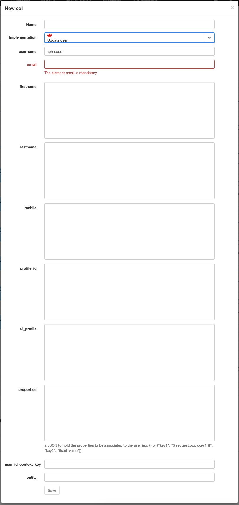

| Attribute | Description |
| --- | --- |
| username | The username of the user to identify it. |
| email | The email address of the user. |
| firstname | The first name of the user. |
| lastname | The last name of the user. |
| mobile | The mobile number of the user. |
| profile_id | The profile of the user. <br /> This is the profile of the user in the APIO core engine. |
| ui_profile | The UI profile of the user. <br /> This only influence the view of the user in the APIO core UI. |
| properties | The properties of the user. <br /> This is a JSON object. |
| user_id_context_key | The context variable to assign the user ID to. |
| password_context_key | The context variable to assign the password to. |
| auth_backend | The authentication backend to use. <br /> This is the name of the authentication backend as defined in the APIO core configuration. |
| user_id_context_key | The context variable to assign the user ID to. |
| entity | The entity of the user. If it's set, the user is treated as a technical user for M2M exchanges. |

## Delete user

Technical name: `delete_user`

Delete a user locally on the system.

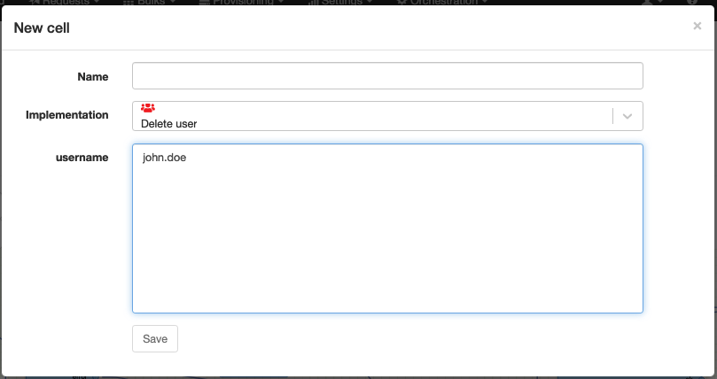

| Attribute | Description |
| --- | --- |
| username | The username of the user to delete. |

## Get owner (deprecated)

Technical name: `get_owner`

Get the owner of the current request. Use `{{ user }}` (see [template variables](templates/#variables)) in your template to access the owner attributes instead.

## Search transactions

Technical name: `search_transactions`

Search instances in the APIO core engine database.

The result is a list of instances matching the query.

The query supports the following criteria:

* instance_id: the ID of the instance
* guid: the GUID of the instance
* status: the status of the instance
* activity_id: the ID of the activity
* activity: the name of the activity
* user_id: the ID of the owner of the instance
* label: the label of the instance
* created_on: the creation date of the instance
* updated_on: the last update date of the instance

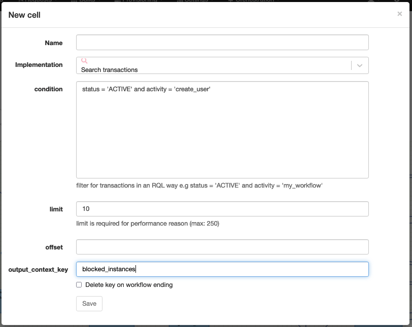

| Attribute | Description |
| --- | --- |
| query | The query to execute. |
| limit | The maximum number of instances to return. |
| offset | The offset of the first instance to return. |
| output_context_key | The context variable to assign the result to. |

## CSV file

Technical name: `create_csv`

Create and attach a CSV file to the current request.

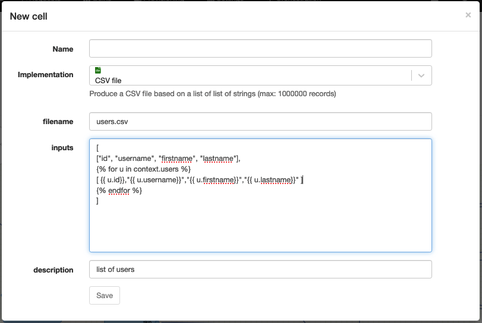

| Attribute | Description |
| --- | --- |
| filename | The name of the CSV file to create. |
| inputs | The list of inputs to use to generate the CSV file. |
| description | The description of the generated document. |

## Excel file

Technical name: `create_excel_sheet`

Fill an Excel sheet with data and attach it to the current request.

The base has to be stored in the templates of the platform. So it can contains all sort of data / elements, they will be kept in the generated Excel file.

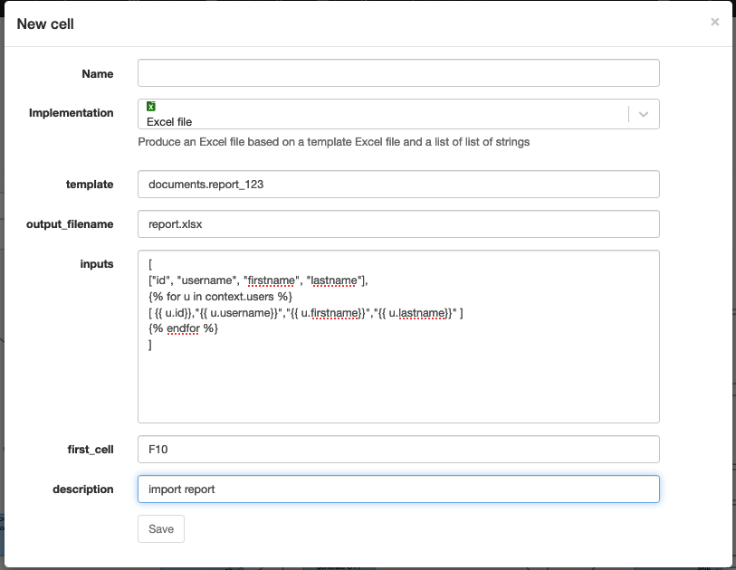

| Attribute | Description |
| --- | --- |
| template | The name of the Excel template to use. |
| output_filename | The name of the generated Excel file. |
| inputs | The list of inputs to use to fill the Excel file. |
| first_cell | The first cell of the Excel sheet to fill. <br /> It may also contains a reference to another sheet (e.g Sheet2!A8) |
| description | The description of the generated document. |

## Powershell

Technical name: `powershell`

Execute a Powershell script in a dedicated docker container wired to the platform.

There is a limit on the number of running containers per platform: (2 * the number of CPU's) + 1.
A timeout of 2 minutes waiting for a container to be available. And a timeout of 5 minutes for the execution of the script.

The output of the script is limited to 4MB.

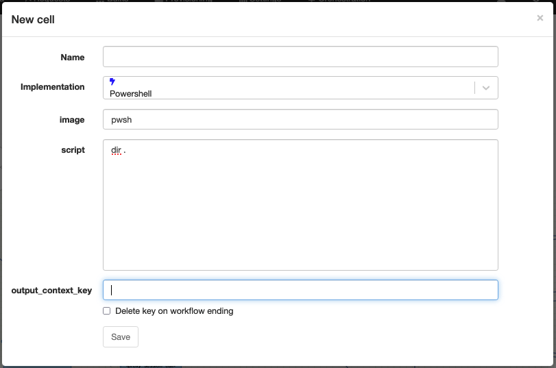

| Attribute | Description |
| --- | --- |
| image | The docker image to use. |
| script | The Powershell script to execute. |
| output_context_key | The context variable to assign the result to. |

## (S)FTP

Technical name: `ftp`

Execute an FTP command on a FTP or SFTP server.
(incl. uploading / downloading files)

The FTP server has to be defined in the APIO core configuration as a TCP gateway with url scheme of `ftp://` or `sftp://`.

:::tip

If a file is not found on the FTP server while trying to download it, and the output "not_found" is connected, the workflow will continue on this output.

:::

:::caution

The files can be downloaded / uploaded from the APIO core filesystem *but* it may cause troubles if the workflow ran on a different node than the one where the file is stored.
Or if the workflow stops and restarts on a different node.

:::

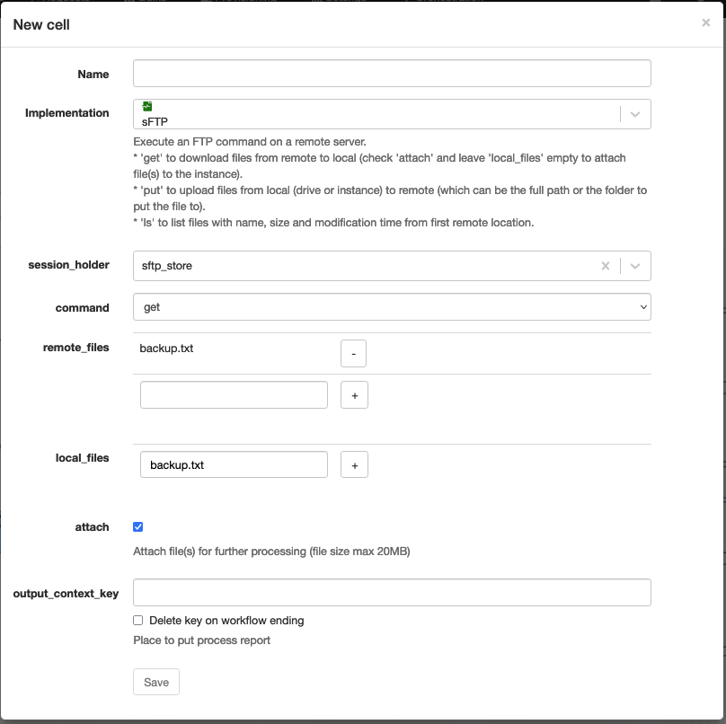

| Attribute | Description |
| --- | --- |
| session_holder | The session holder to use. |
| command | The FTP command to execute. <br/> * get: to download a file <br/> * put: to upload a file <br/> * ls: to list a remote directory |
| remote_files | The list of remote files to use. <br/> * For `get` and `put` commands, it's the list of remote files to download / upload. <br/> * For `ls` command, it's the list of remote directories to list. |
| local_files | The list of local files to use. <br/> * For `get` and `put` commands, it's the list of local files to download / upload to. |
| attach | If set to `true`, the downloaded files are attached to the current request. Use the local file system otherwise |
| output_context_key | The context variable to assign the result to. |

## Entity

Technical name: `entity`

Represents an external entity in the workflow. This node is used to symbolize the external process of an entity which is not managed by APIO core.
