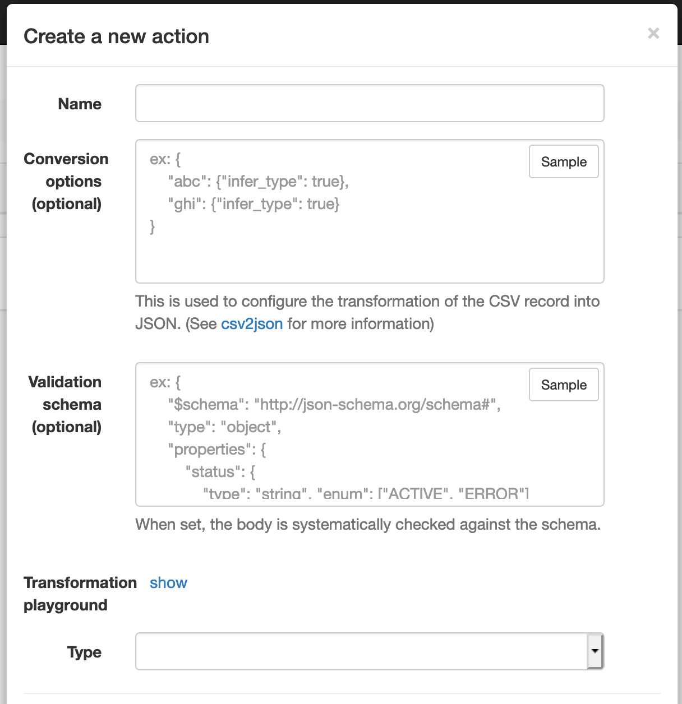
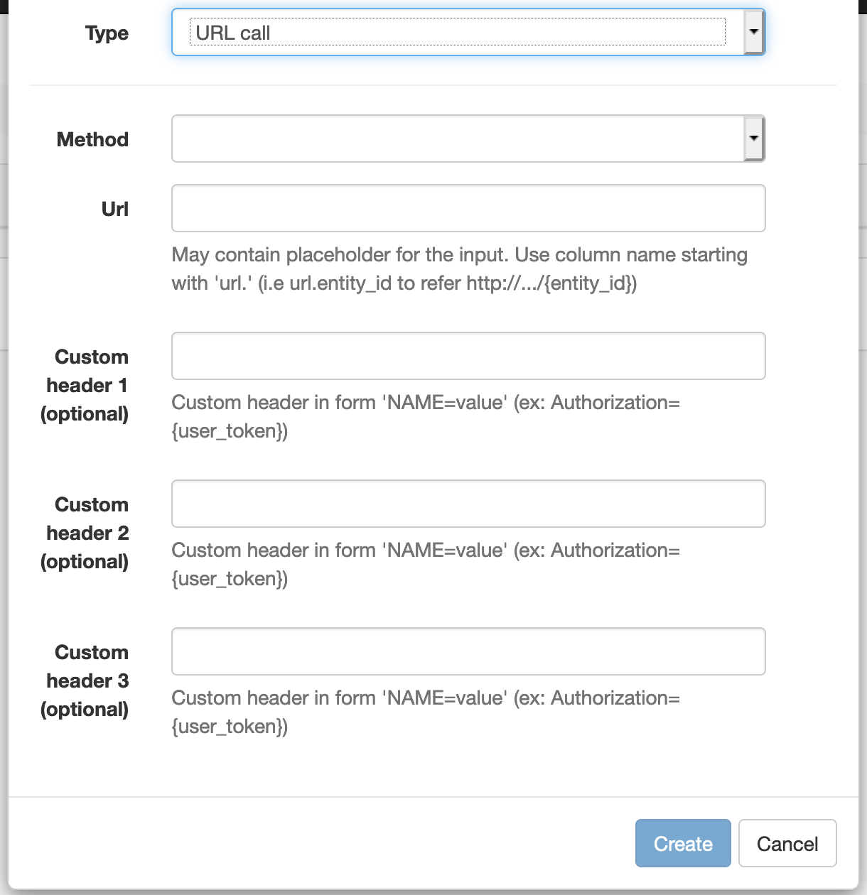
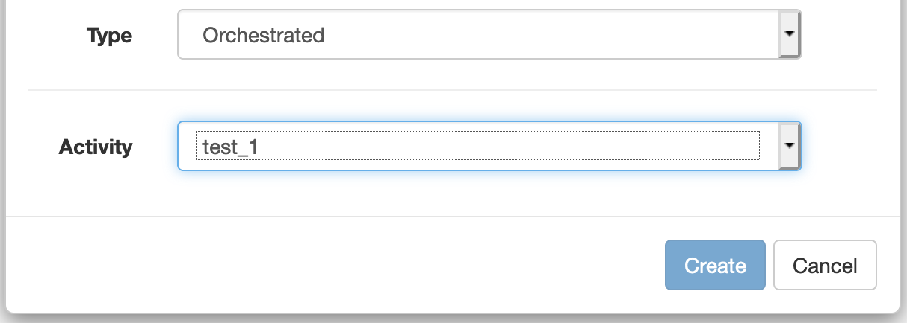

# Bulk actions

Configure processes to be available on bulk screen.

## Concepts
### What is an action?

It's a view which turns an input file (usually CSV with ";" delimiter) into a JSON to be used as input for:
* An HTTP call
* An orchestrated workflow

### Why CSV?

Because CSV is commonly used in the industry to feed bulk operations.

### Why turning into JSON?

Because JSON (as an architectural decision) was chosen as the single input format for the API server.
Plus, JSON is a format offering a high level of support and a good balance between flexibility, readability and validation.

## New action

* Name: a unique identifier for the new action
* Conversion options: a JSON object which may customize the transformation process turning the CSV => JSON (the object is passed as is to the library [csv2json](https://github.com/rockwelln/csv2json), you may refer to it as reference documentation).
* Validation schema: a JSON object used to validate the JSON output of the transformation process (the object is passed as it to [jsonschema](https://python-jsonschema.readthedocs.io/en/latest/), you may refer to it as reference documentation)
* Transformation playground: to help the user to tailor made the transformation / validation, the playground can be used to try the "conversion options" and "validation scheme" mentioned above on a CSV sample (headers + 1 row).
* Type: choose the type of action to be triggered

Depending on the type of the action, different fields are made available.

### URL (HTTP call)

* Method: an HTTP method
* Url: An url which may contain placeholders referring to the input using the object named 'url' (ex. header url.entity_id refer http://.../{entity_id})
* Custom headers: These are headers which may hold custom values passed to the HTTP call.  
  May contain placeholders, for instance:
  * Authorization={user_token} : automatically replaced with user token on the server

### Orchestrated

* Activity: point to the activity / workflow to be triggered with the input