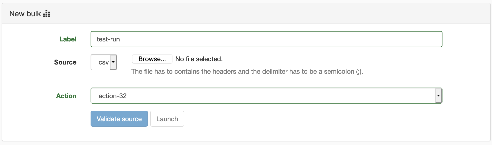
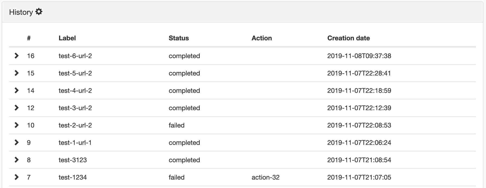
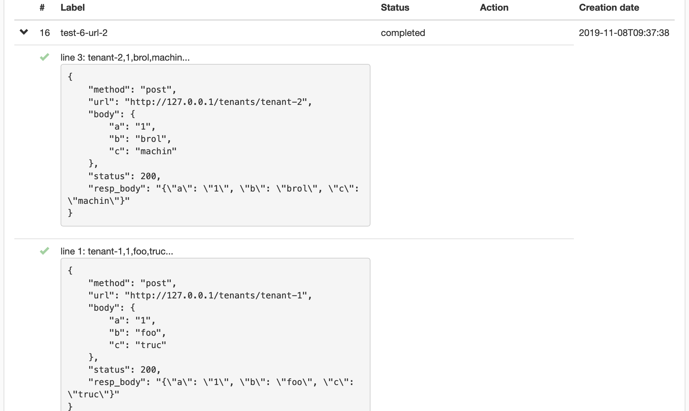
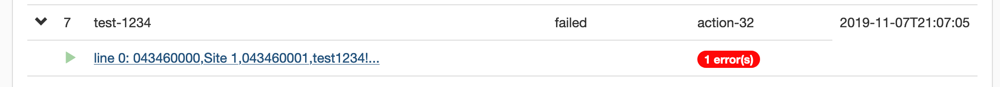

# Bulks

Bulk page expose the processing of bulks on the server.

## New bulk

* label: a **unique** name for the bulk run
* source: a data source to feed the run

> The source file has to contains the headers and the delimiter has to be a semicolon (;).

* action: indicates the processing to drive the run (actions are configuration in [Settings / Bulk actions](./bulk_actions.html).

To trigger the run, the source need to be validated first against the rules defined to check the input to prepare the run.
If the source is validated, the run is allowed and can be triggered.

Further information about the run are available in the history.

## History

The last 20 runs are shown in this section.

Details are available per run to details and show what happened.

